# 区块链是什么鬼？

> 摘要:
> 区块链不过是一种组织数据的结构，数据结构不会自然带来那些好的属性。不可篡改性和可信任性的终极来源其实是抗女巫措施赋予的成本以及账簿保存的免许可性。

除非你是山顶洞人，我确信你已经听说了**比特币**（Bitcoins）和**区块链**。毕竟，它们是热点，也是年度流行词。连那些从来没有听过加密货币（cryptocurrency）、根本不知道它如何运行的家伙们也在谈论它。我的朋友中，非技术宅可比技术宅要多。为了让我给他们解释这个新流行词，他们已经骚扰我好几个星期了。我猜，成千上万人跟我有着同样的感受。当这种情形出现，是时候要写一些东西了，好让每个人都能戳醒那些糊涂蛋——这就是这篇推送的目的——以浅白的写作，让任何普通的网友都能理解。

## 区块链：为什么我们需要这么复杂的东西

> “每一个复杂的问题都有一个清晰、简单并且是错误的答案。” ——H.L.Mencken

与互联网上的其它任何推送相反，我们不会一开始就定义什么是区块链，我们会先认识它要解决的问题。

想象一下，Joe 是你最好的朋友。他正在海外旅游。在他假期的第五天，他给你一个电话，“Dude，我把钱花光了，江湖救急。“

你回答“马上汇款”然后挂掉电话。

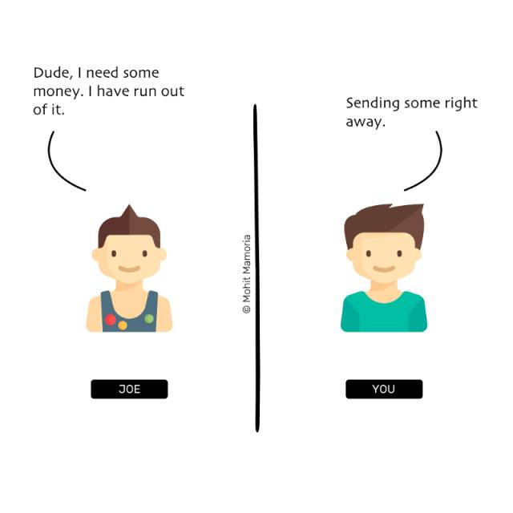

然后你打电话给你银行账户的经理，“请从我的账户转 1000 美元到 Joe 的账户上”。

你的账户经理回复，“收到，先生”。

他打开账簿，查看你的账户以确定你有足够的余额转出 1000 美元给 Joe。因为你是个土豪，账上还有大量余额，因此，他在账簿上登记了一个条目，正如下图所示：

> 注意：我们不提计算机，只是为了让例子简单一点。

你打电话给 Joe，告诉他，“我已经转账了。下一次你去银行的时候，你就可以取出我刚刚转过去的 1000 美元。”

这是怎么一回事呢？你懂的，这就是说，你和 Joe 都委托银行来管理你们的钱。并没有物理票据的实际流动来转移你们的钱。所需的一切不过是账簿上的一个条目。或者更准确一点，账簿上的一个既不受你和 Joe 控制、也不被你们所拥有的条目。

这就是现有体系的问题。

为了在我们之间建立互信，我们依赖于独立第三方。

多少年了，我们依赖于这些中介以信任彼此。你也许会问，“依赖他们有什么毛病？”

毛病在于，它们清一色只是数字。如果要在社会上引发一场混乱，它需要的一切不过是一个人或者一个机构走向贪腐堕落，无论是有意识地，还是无意识地。

要是记录下这笔转账的账簿在一场大火中烧成灰烬了呢？

要是，你的银行经理搞错了，写了个 1500 美元而不是 1000 美元呢？

要是，他根本就是有意为之呢？

多年以来，我们一直把自己所有的鸡蛋都放在一个篮子里，并且还是别人的篮子。

会有这样一个系统吗，在那里我们无需银行就可以转账？

要回答这个问题，我们需要挖得更深，问自己一个更好的问题（毕竟，只有更好的问题才会导向更好的答案）。

想一下，转账意味着什么？只是账簿上的一个条目而已。那么更好的问题将是——是否有某种手段，可以在我们中间维护那本账簿，而不是让其他人来为我们操作？

现在，总算有一个值得探究的问题了。而答案你或许已经猜到了。区块链就是这个深奥问题的答案。

它就是一种在我们中间维护账簿而非依赖其他人来为我们代劳的方法。

你能跟上来吗？很好。因为现在许多问题已经开始在你脑海中爆炸，我们将学习这一分散式账簿是如何工作的。

## 它是怎么工作的

这一方法的要求是：必须有足够的人不想依赖第三方。只有这样，这群人才能靠自己来维护他们的账簿。

> “只让人们在比特币带来的交易中获取比特币，或许是有意义的。一旦有足够的人这样想，它就会变成一个自我实现的预言。”——中本聪，2009

多少人才算是够？至少要 3 个。打个比方，我们假设有 10 个人想抛弃银行以及任何第三方。根据相互之间的协议，他们可以一直拥有彼此的账号信息——但不知道其他人的真实身份。

1. 一个空的文件夹

   一开始的时候，每个人都掌握着一个空文件夹。正如我们要进行的那样，这 10 个人都将持续向他们的当前的文件夹中添加纸张。而这些纸张的集合将形成追踪交易的账簿。

2. 一笔交易发生的时候

   然后，这个网络中的每个人都将有纸笔在手。每个人都准备着记录下该系统内部发生的任何交易。现在，假设#2 想要转 10 美元 给#9。为了完成这次交易，#2 吼了一嗓子，告诉每个人，“我想转 10 美元给#9。大家都在自己的小本本上记下来！”

   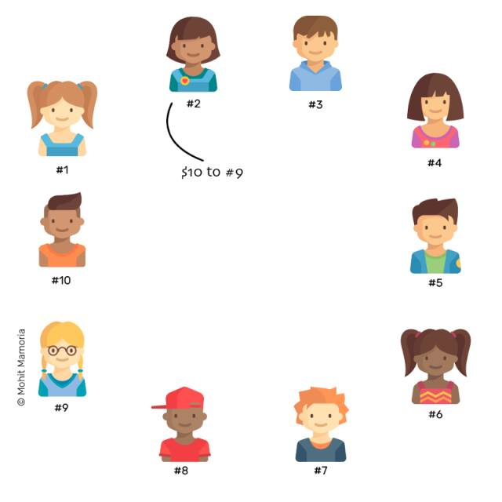

   每个人都瞄一下#2 是不是有足够的余额可以转 10 美元给#9。如果她有足够的钱，每个人都在自己的空白页上为这笔交易做了一个记录。

   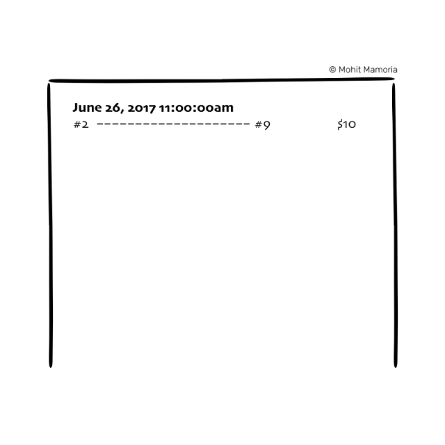

   这样，一笔转账就被认为是完成了。

3. 交易继续发生

   时间过得很快，这个网络中的更多人想要转账给其他人。无论什么时候他们想要做一笔交易，他们就向其他所有人宣告这笔交易。无论是谁，一听到这个宣言，就在他/她自己的纸张上写下来。这样的实践持续进行，直到每个人都用完了他们当前页的空间。假设 1 页纸可以记录 10 笔交易，一旦 10 笔交易完成，每个人就都用完了空间。

   

   纸张被写满的时候

   那么，是时候该将这页纸存到文件夹里面，然后拿出一张新的纸、重复上述步骤 2 了。

4. 存放纸张

   在你将这页纸存入我们的文件夹之前，我们需要使用该网络中每个人都同意的唯一一把钥匙来密封它。通过密封，我们可以保证，一旦该页纸的备份已经被存入每一个人的文件夹，没有人能够对它作出任何更改——不止今天，不止明天，也不止是一年以后。一旦放入文件夹中，它将永远呆在文件夹里面——被封存起来。而且，如果每个人都信任这个封条，那么每个人都会相信该页纸中的内容。而这页纸的封存手法，就是这一方法的关键。

   > [术语箱]这一用来保护纸张内容的东西被人们称为“矿”，但为了简化它，我们还是称之为“封条”。

   早些时候，第三方/中介为我们赋予信任，其形式是：无论它们在账簿上已经写了什么，都永远不可变更。在一个分散式的、去中心化的系统中，就像上述我们的系统一样，这种封条将提供信任替代。

   因缺斯汀！那我们怎么密封这份记录呢？

   在我们学习如何能密封这页纸之前，我们要知道，一般而言，封条是怎么工作的。要做到这些，先决条件是学习一些东西，我喜欢称之为……

   **魔法机器**

   想象一个被厚墙围起来的机器。如果你从左边塞一个存有东西的盒子进去，它就会吐出一个带着其它东西的盒子。

   > [术语箱] 这个机器被称为“哈希方程”，但我们又没有心情搞得那么专业。所以，今天，它们就叫“魔法机器”。

   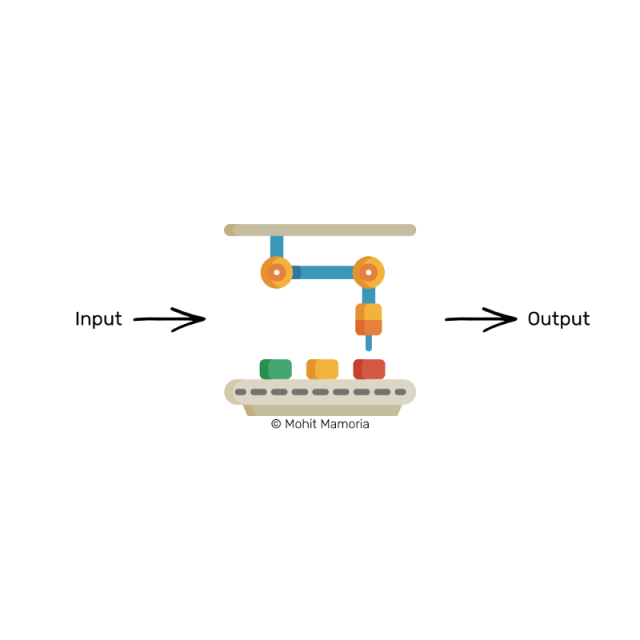

   魔法机器（又叫做 哈希方程）

   假设，我们从左边塞了个数字 4 进去，我们会发现，它在右边吐出了下列字串：‘dcbea’。

   数字 4 是在怎么转化成这串字符的？没有人知道。而且，这个过程是不可逆的。得到了这串字符‘dcbea’，也不可能搞清楚这机器从左边接收到了什么。但是，任何时候，你输入数字 4 给这台机器，它都总是会吐出同样的字符，‘dcbea’。

   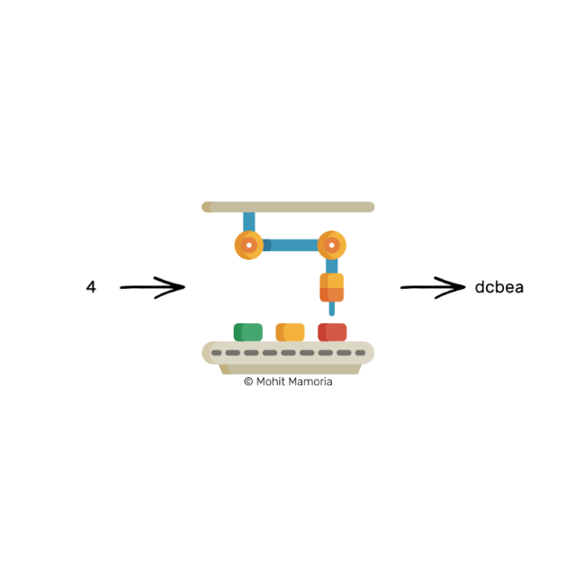

   来试试发送一个别的数字进去。26，怎么样？

   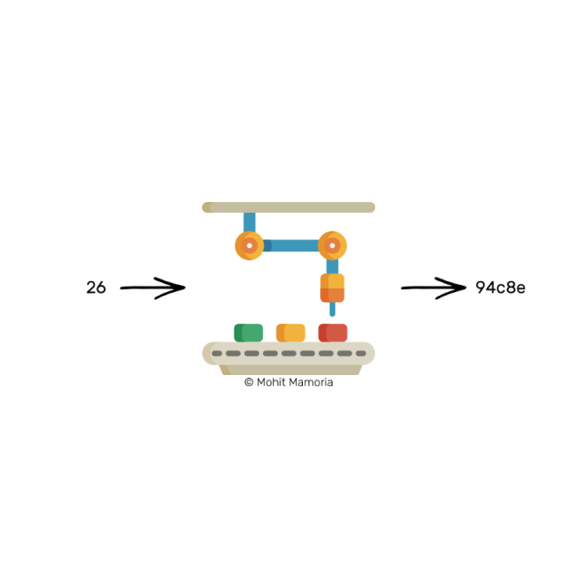

   hash（26）==94c8e 这次我们得到了‘94c8e’，看来字符同样可以包含数字。有意思！假如我现在问你如下问题，事情会变成什么样？

   “你能不能告诉我，要想在机器右边得到三个 0 开头的一串字符，我该从左边输入什么东西进去呢？比如，000ab，或者，00098，或者，000fa，或者其它情况中的任何一个。”

   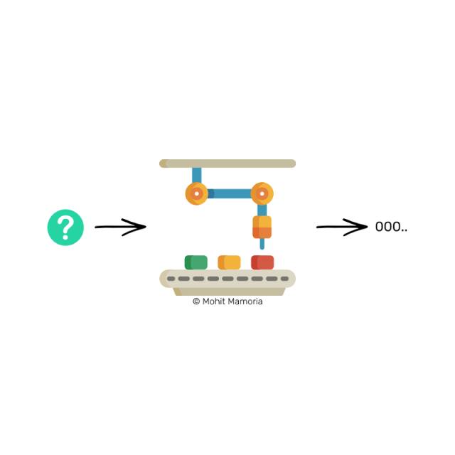

   想一想这个问题吧。

   我已经告诉过你，这台机器有个属性：在我们从右边得到期望的输出值之后，我们无法计算出来什么是我们必须从左边输入进去的。给我们这样一台机器，我们如何能回答我问的那个问题？

   我可以想出一个办法。为什么我们不一个接一个地遍历宇宙中所有数字，直到我们得到一个三个 0 开头的一串字符？

   

   尝试所有数字以算出需要的输入值

   乐观估计，经过几千次尝试之后，我们最终会得到将在右边产生要求的输出值的一个数字。

   

   在给定输出值的时候，要算出输入值是极其艰难的。但与此同时，如果预测的输入值可以产生需要的输出值的话，它又是极为容易验证的。要记住，投入一个同样数字，这台机器每一次都会吐出同样的字符。

   如果我给你一个数字，比如 72533，然后问你一个问题：“这个数字，输入这台机器之后，会产生一个以三个 0 开头的字符串吗”，你觉得要得出答案有多难呢？

   你要做的一切，不过是丢这个数字进去，然后查看我们在右边得到了什么。就这样。

   这样的机器最重要的属性就是——“给定一个输出值，要算出输入值是极端困难的。但是，给定输入值和输出值，要检验该输入是否会导致该输出，却是非常容易的。”

   在这片文章剩下的部分，我们要记住这台魔法机器（或者说哈希方程）的这一属性：

   “给定一个输出值，要算出输入值是极端困难的。但是，给定输入值和输出值，要检验该输入是否会导致该输出，却是非常容易的。”

   如何用这样的机器来加密一份文件？

   我们将使用这台魔法机器为我们的纸张产生一个密封条。按照惯例，我们将从一种想象的情形开始。

   想象我给你了两个盒子。第一个盒子装着数字 20893。然后我问你，“你能不能找出一个数字，加上装在第一个盒子里面的数字以后，输进这台机器，最终会给我们一个以三个 0 开头的字符？”

   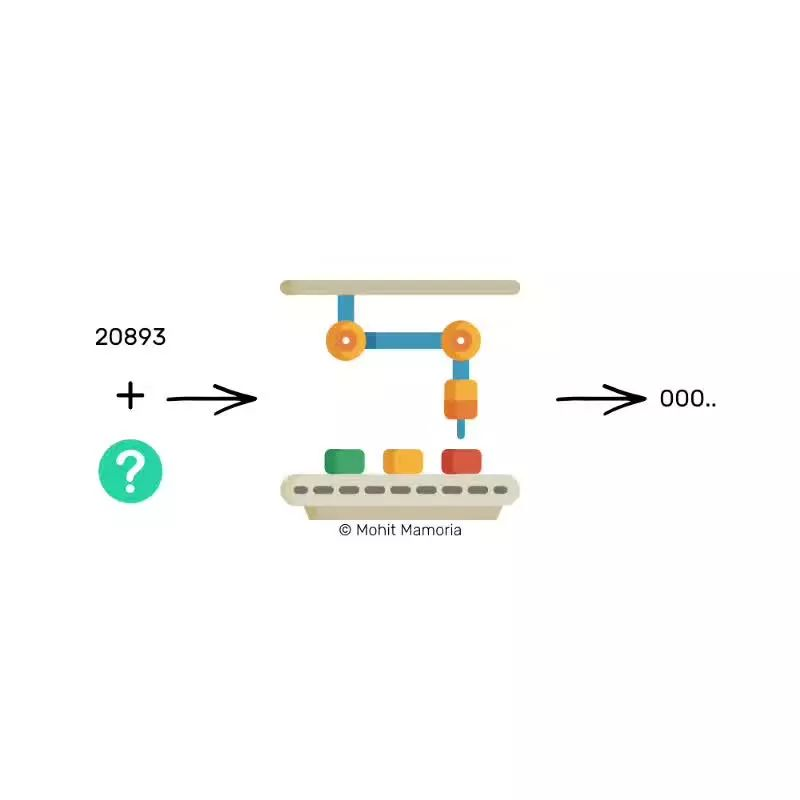

   这种情形跟我们在之前看到的很相似，而我们已经知道，算出这样一个数字的为唯一方法就是穷举整个宇宙中每一个可能的数字。

   又是几千次尝试之后，我们会偶然发现一个数字，比如 21191，加上 20893 以后（比如：21191+20893=42084）输入机器，将产生一串符合我们要求的字符。

   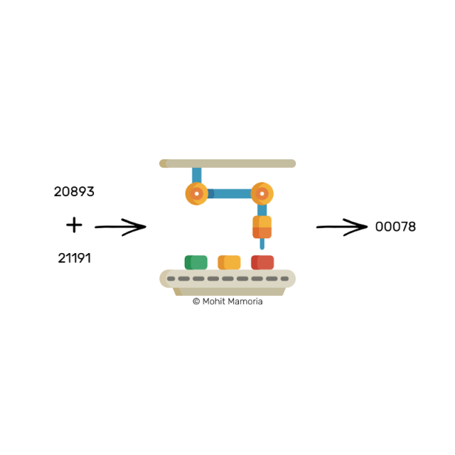

   在这个例子中，数字 21191 就成了数字 20893 的封条。假设现在有一张纸，数字 20893 写在上面。为了密封这页纸（比如：使得没有人能更改这页纸上的内容），我们将盖一个带有标签‘21191’的徽章在上面。一旦密封数字（比如：21191）被戳在纸上，这页纸就被密封了。

   

   > [术语箱] 密封数字又被称为“工作量证明”，意思是，这一数字证明了为了计算出它来已经付出的努力。为了我们的目的，我们最好还是称之为“密封数字”。如果任何人想验证这页纸是否已经被替换了，他需要做的一切不过是——将这页纸上的内容与密封数字加在一起、把和值输入那台魔法机器。如果机器给出了一串三个 0 开头的字符，那么内容就没有被改变。如果出现的字符不能满足我们的要求，我们就可以丢掉这页纸了，因为它的内容已经有了水分，没有任何用处了。我们将使用一个简单的密封机制来封存所有的记录，最终在我们各自的文件夹中编排好它们。

   最后，封存我们的文件

   要密封包含着我们网络中交易内容的记录，我们将需要算出一个数字，该数字在添加到交易记录清单上、输入机器以后，可以使我们得到一串三个 0 开头的字符。

   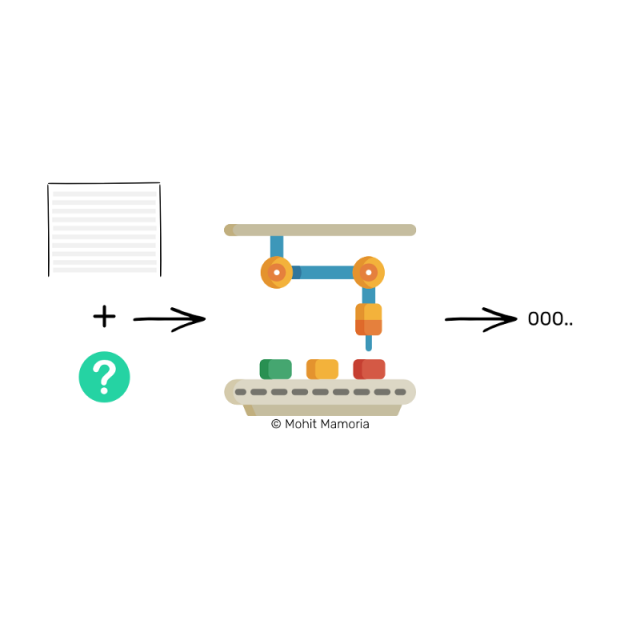

   注意：我一直在使用的“三个 0 开头的字符”，只是一个例子。它阐明了哈希方程是怎么工作的。实际当中的挑战要比这个复杂得多。

   我们会在这机器上花费时间与电力，然而一旦我们算出那个数字，这页文件就被那个数字封存起来。永远永远，如果有人尝试改变这页纸上的内容，这个密封数字允许任何人去验证这页纸的完整性。

   现在，我们既已知道封存记录的手法，我们将回到我们在这张纸上写完了 10 条交易、没有空间书写更多记录的时候。

   一旦每个人都用尽一页纸的空间、无法记录进一步的交易，他们就开始卖力地计算该页纸的密封数字，使得它可以被藏入文件夹中。在网络中，每个人都进行这个计算，而最早算出密封数字的那个人会向其他所有人宣布这个数字。

   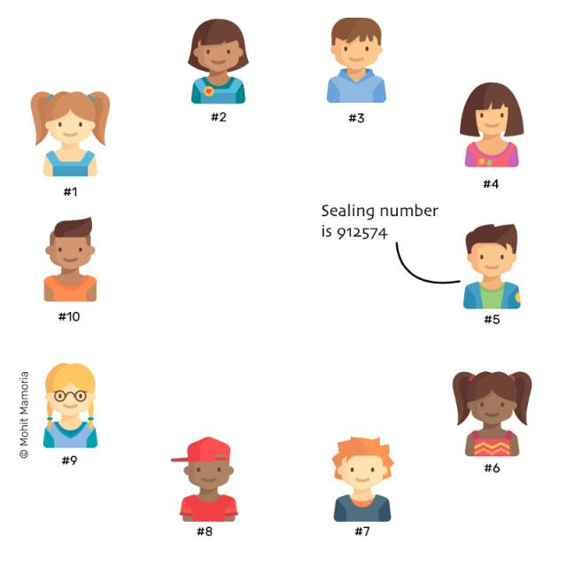

   听到密封数字之后，每个人都立即验证它是否能产生要求的输出值。如果是的，每个人都为他们的纸张标上这个数字，然后把纸张放入文件夹中。

   但是，如果对某人，比如#7 来说，那个被宣布的密封数字无法产生要求的输出值，怎么办？这种情形可并不少见。可能的原因有：

   - 他可能听错了之前在网络中宣布的交易
   - 他可能写错了之前在网络中宣布的交易
   - 他可能在记录交易的时候试图作弊，为了谋私，或为讨好网络中的某些人

   无论原因是什么，#7 只有一个选择——放弃他的记录、从其他人处获得拷贝，以使他也可以将纸张放入文件夹。除非他不将他的纸张放入文件夹，他也就无法继续记录进一步的交易，这会因此禁止他成为网络中的一员。

   大部分人同意的密封数字，无论是它是什么，都会成为那个可信的密封数字。

   可是，如果他们知道其他人会算出它然后宣布它，为什么每个人都要耗费资源来进行计算呢？为什么不坐视不理、等着抱大腿呢？

   好问题。这就是激励加入到这幅图景的地方。每一个区块链的成员都有资格获得奖励。第一个计算出密封数字的人将得到免费的金钱作为对他的努力（比如：付出的 CPU 算力和电力）的奖励。

   简单地设想一下，如果#5 为一页记录算出了密封数字，他得到了一些免费的钱作为奖励，假设是凭空铸造出来的 1 美元。换句话来说，#5 的账户余额增加了 1 美元，同时没有任何人的账户余额有所减少。

   这就是比特币变为现实的方式。它是在区块链（比如：分散式的账簿）上被用来交易的第一种货币。同时，人们被奖励以比特币作为回报，以使在网络上，（计算密封数字的）努力会继续进行。

   当足够多的人持有比特币，比特币会升值，使得更多人想要比特币；这会使比特币进一步升值；这升值又使更多人想要比特币；这愿望又进一步使比特币升值；如此循环往复。

   这种奖励，使得网络中的每一个人都不停歇地工作。

   一旦每个人都往文件夹中叠进一页纸，他们会拿出一页空白纸张，再一次重复整个过程——直至永远。

   > [术语箱]将一页纸想象为记录交易的一个区块、把文件夹想象为纸张（区块）的链条，结果是，它变身成了一个区块链。

   老铁，这就是区块链的工作方式。

---

然而。我还有一件小事没有告诉你。

想象文件夹中已经有 5 页纸——都被一个密封数字加密了。如果我回溯到第二页纸、改动交易记录以谋私，会怎么样？密封数字会让任何人察觉到交易记录中的矛盾，对吗？那假如我更进一步、为修改后的交易记录计算出了一个新的密封数字、将这替代品戳到纸上呢？为了防止这个问题，即有人回溯并且修改纸张（区块）和密封数字，这里还有一个解释，关于一个密封数字是怎么计算出来的。

防止对密封数字的修改

还记得我是怎么跟你说的吗？我给了你两个盒子——一个装着数字 20893，另一个空的让你来计算？实际上，为了在区块链上算出密封数字，有三个盒子，而非两个——两个提前装好的，一个被用来计算的。

而当所有三个盒子里面的内容加起来、输入魔法机器后，从机器右边出来的答案必须满足要求的条件。

我们已经知道了，一个盒子装着交易记录的清单，一个盒子将装着密封数字。而第三个盒子，装着此前纸张的魔法机器输出值。

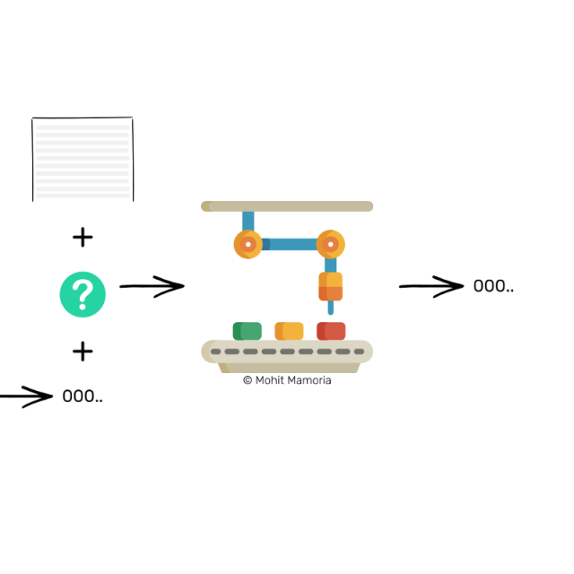

有了这个优雅的小心机，我们可以保证，每一页纸张都依赖于它之前的纸张。因此，如果有人要修改一张历史记录，他将同样必须改变该页以后所有纸张的内容和密封数字，以使这条链保持一致。

如果某个人，不属于我们在一开始设想的 10 个人，试图作弊，修改区块链（保存了所有交易记录清单纸张的文件夹）中的内容，他将不得不调整多页纸张、为所有这些纸张计算新的密封数字。我们都知道计算密封数字有多么困难。因此，这网络中的一个坏蛋欺负不了九个老实人。

将会发生的事情是，从这个不诚实的家伙尝试作弊的那一夜开始，他将要在这网络中创造另一个区块链，但那个区块链将永远无法赶上可信的区块链——仅仅因为一个家伙的努力和速度不可能战胜九个人积累起来的努力和速度。因此，这保证了在一个网络中，最长的链就是可信的链。

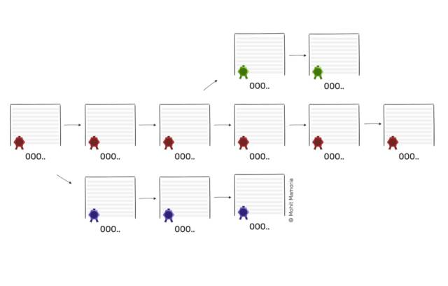

最长的链就是诚实可信的链。

当我告诉你一个不诚实的家伙没法欺负九个实诚人的时候，它是否点醒了你什么？

万一，不是一个，而是六个人搞事情呢？

在这种情况下，这个协议将会落空，流于表面。它就是人们所知的“51%攻击”。如果该网络中的大部分人决定变得不诚实并且欺骗网络中剩下的人，这个协议将无法实现它的目标。任何时候，如果区块链可能会陷落，这就是其脆弱性的唯一原因。知道了这一点，它也就不太可能发生了。但是，我们所有人都必须知道这个系统的这个弱点。它建立在这样的假设之上：一群人中的大部分都总是诚实的。

老铁。这就是有关区块链的一切。任何时候你发现有人感觉落后了、感到迷茫，“区块链到底是什么鬼？”你知道你可以指引他们到哪里去。

> 文章来源：[WTF is The Blockchain?](https://hackernoon.com/wtf-is-the-blockchain-1da89ba19348)
