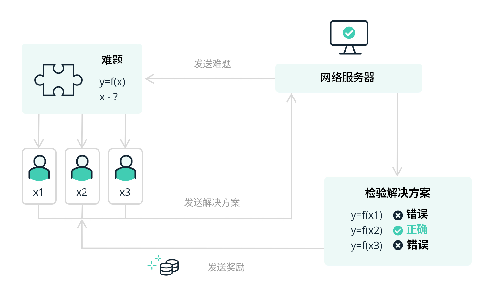
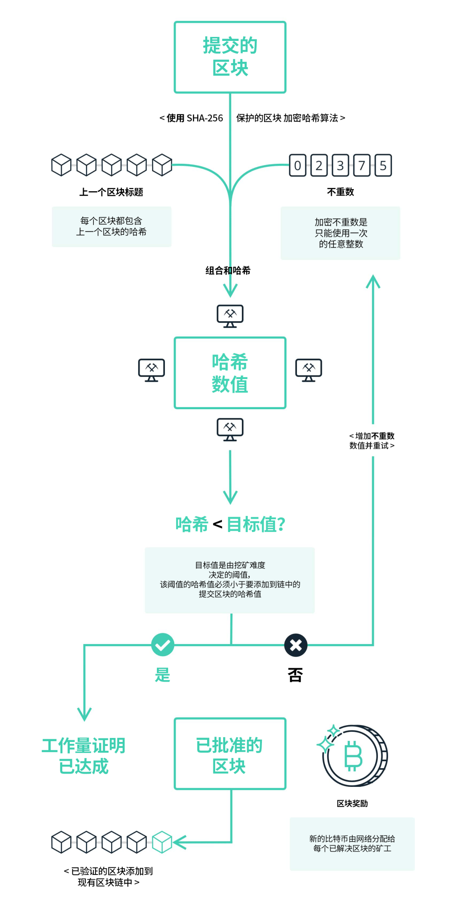
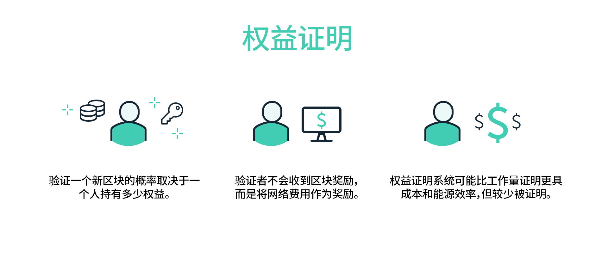
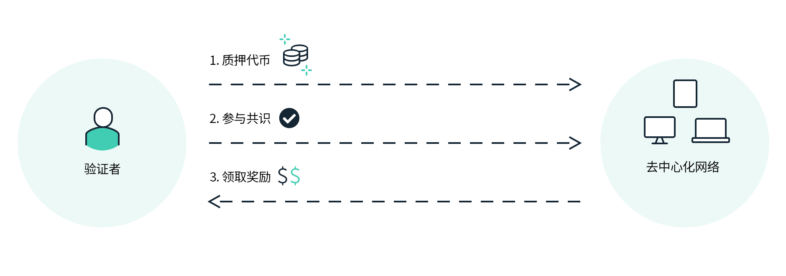
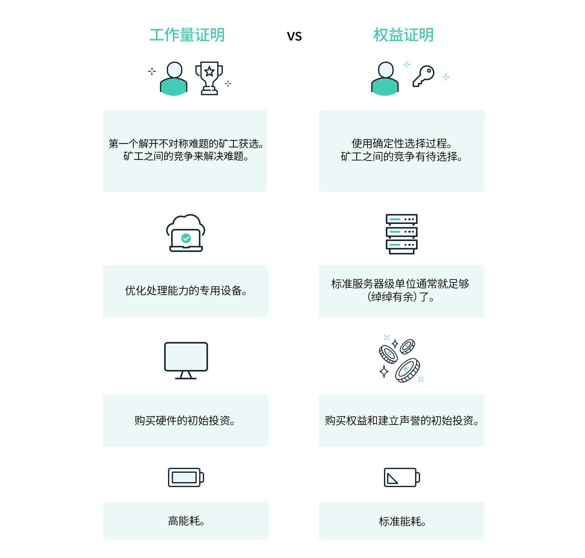

# 共识机制

区块链是一个分布式账本系统，参与者通过点对点网络连接，所有消息都通过广播的形式来发送。系统中存在两种节点：普通节点和共识节点。普通节点使用系统来进行转账、交易等操作，并接受账本中的数据；共识节点负责向全网提供记账服务，并维护全局账本。

我们假设在此网络中，消息可能会丢失、损坏、延迟、重复发送，并且接受的顺序与发送的顺序不一致。此外，节点的行为可以是任意的：可以随时加入、退出网络，可以丢弃消息、伪造消息、停止工作等，还可能发生各种人为或非人为的故障。

我们采用密码学技术（共识机制）来保证消息传递的完整性和真实性，消息的发送者要对消息的散列值进行签名。

目前主流的共识机制有三种：工作量证明（POW），权益证明（POS），还有 Neo 使用的委托拜占庭容错（dBFT）。

## 工作量证明（POW）

工作量证明 (PoW) 是区块链网络的共识算法，是比特币的底层共识模型。 比特币是率先使用 PoW 的加密货币。

概括而言，PoW 依赖于将电能转化为数字区块链的“权重”，这构成了比特币等 PoW 区块链不可伪造的成本，并在此过程中推动激励结构，产生了拜占庭容错 (BFT) 分布式网络。

### 比特币的中本聪共识

要了解 PoW 的机制，最好的方式就是通过观察比特币的中本聪共识，它是成功且可持续的 PoW 实现不可动摇的主要例子。

PoW 机制通过解决数学难题得到一个低于特定阈值（随机数）的值，用于产生下一个向网络播送的区块。 产生下一个区块的区块领导者直接根据各自在解决过程中贡献的计算能力（即哈希）通过类似抽奖的方式选取。 正如中本聪在[比特币白皮书](https://zhuanlan.zhihu.com/p/28614698)中的解释：

> “工作量证明还解决了在多数决策中如何确定代表的问题。如果基于一个 IP 地址一票的方式选出多数，那么任何能够分配多个 IP 的人都可以破坏投票。工作量证明本质上是一个 CPU 一票。为工作量证明投入最多的将成为最长的链，也将成为多数决策的代表。如果大部分 CPU 算力由诚实节点控制，那么诚实链的增长也会最快，远超任何与之竞争的链。”

最长的链工作量最多，也就意味着它贡献了最多的算力（即哈希），因此可以轻松确定身份。

PoW 共识模型有两类主要参与者：矿工和全节点运营商。

### 矿工

矿工是参与者市场，参与者为了解决难题并生成下一个向网络播送的区块相互竞争，新区块每 10 分钟生成一个。 在每个 10 分钟回合内获胜的矿工将获得区块奖励（目前为 12.5 BTC）和区块内的交易费用。 这种设计能够促进矿工激励系统运转，让矿工在播送区块时保持诚实，原因主要有二。

首先，矿工们花费大量资金购买昂贵的硬件设备，消耗电能进行连续计算，通过暴力破解答案解决比特币的挖矿算法。

如果矿工试图采取恶意行动破坏挖矿，并在此过程中损害了比特币的信誉，那他们就需要花费更多资金采购硬件设备，因为区块奖励比特币的投资回报 (ROI) 价值也会降低，这就引出了第二个原因。

矿工直接以比特币而非现金形式赚取奖励。 这样一来，他们就会将现实世界的资源（电力）用于生产比特币，从而造就了比特币整个安全模型的重点所在，即不可伪造的成本类型。 此外，由于矿工不仅愿意投入法定货币（购买硬件设备），而且愿意将实际资源投入到比特币的生产中去，区块链也就被赋予了现实世界价值。

比特币的发行与货币政策也随之被挖矿过程绑定，随着网络的哈希算力增长到目前的比例，这些政策已经几乎不可能改变了。 由于需要出售部分持币赚取利润以及支付账单，矿工们会按照现货价格向市场巧妙地分发比特币。

### 全节点运营商

PoW 中的第二类实体是全节点运营商或者运行全节点的普通用户。 全节点是运行比特币软件的软件客户端，可以自动验证网络中的交易和区块并进行播送。

全节点运营商运用加密证明和比特币共识规则，是网络的心脏所在，也是网络状态的最终验证者。 挖矿客户端也可以成为全节点客户端，并且客户端会拒绝网络中的无效区块和交易。

由于高能耗设计，链上交易的执行能力也较弱，PoW 一直遭受批评，但有几点需要提醒一下。 例如，绝大多数比特币挖矿活动使用的是可再生能源，而在能源开销与比特币整体价值和财富创造之间取得平衡则是一项复杂的任务。 无论如何，PoW 是计算和博弈论设计的一项重大创新。

比特币的 PoW 模型是融合了博弈论激励、分布式计算、社会共识、市场经济学和加密证明的安全手段。 正是这项创新使得区块链能够在安全可持续的分布式共识下发挥作用，而比特币十余年的存在本身就是对此最好的证明。

## 权益证明（POS）

权益证明 (POS) 是一种区块链网络共识算法，该算法基于随机选择的验证者来生产并批准区块，验证者通过在区块链内锁定代币来“质押”原生网络代币。 验证者根据自己的权益质押总额获得奖励，此举可以用投资回报 (ROI) 来激励节点验证网络。

比特币工作量证明(PoW) 共识需要消耗大量能源，人们普遍认为 PoS 是其更加环保、更可扩展的版本。

### 验证器

在权益证明区块链中，被选出的验证者根据自己的权益质押情况产出下一个区块。 尽管通常会设计随机函数来避免共识抢跑，但权益质押数额较大的验证者生成下个区块的机会也的确更大。 区块先由部分验证者提交，然后向其他验证者播送，由这些验证者核实后将获得批准的区块添加到区块链。

### 网络获得的好处

权益证明在设计上具有多项富于吸引力的要素。 值得注意的是，由于激励方式以经济为动力，发放原生代币作为奖励，PoS 得以绕开工作量证明中抽奖般的计算过程。 这种设计在性能和安全性方面带来了一些重要影响。

在性能方面，PoS 具备“快速最终性”共识的设计，在每秒链上交易 (TPS) 和网络转账实际结算方面的表现都更加优异。

而在安全方面，验证者也更有动力在生成区块以及批准交易时诚实行事，主要原因有二。

首先，验证者有可能控制相当大一部分网络代币，这在经济上激励他们维护链上安全。 否则他们就将面临安全漏洞对自己手中代币价格造成负面影响的窘境。 其次，如果验证者选择恶意操作并生成虚假区块，那他们为了生成区块而按照锁定机制所质押的权益就会面临着遭到“削减”或被剥夺控制权的威胁。

### 加密货币所有者获得的好处

不想亲自担任验证者的加密货币所有者也可以通过参与网络生态系统获得奖励。

现在有多种通过权益质押产生收入的方法。 其规则取决于您所使用的区块链。 参与前请确保详细了解各种协议。

- 持有奖励 – 用户只需让加密货币在自己的钱包里放上一段时间，即可赚取奖励。 无需为钱包内的币采取任何具体的权益质押操作。 奖励将取决于持有者钱包内币的数量，经常还取决于存放时间。 此类奖励的申领可能由协议自动执行，也可能需要用户操作。
- 参与/委托奖励 – 用户将自己的部分权益委托给负责保护网络的验证者。 验证者与委托权益给自己的用户分享部分权益质押收入，由此产生奖励。此类奖励既可能由协议自动执行，也可能取决于验证者的善意。

### POS 的缺点

## 委托拜占庭容错（dBFT）

拜占庭容错技术是一种解决分布式系统容错问题的通用方案。NEO 在 PBFT（Practical Byzantine Fault Tolerance， 实用拜占庭容错）算法的基础上，提出了 dBFT（delegated Byzantine Fault Tolerance， 委托拜占庭容错）共识算法。算法根据区块链实时投票情况，决定下一轮参与共识的节点，有效降低了算法耗时，从而提高了出块速度，同时降低了交易确认周期。2019 年 3 月 又在原 dBFT 算法的基础上提出了升级版算法 dBFT 2.0，引入了三阶段共识机制和恢复机制，进一步提升了算法的鲁棒性和安全性。

### 算法

我们的算法同时提供了安全性和可用性，只要参与共识的错误节点不超过 ⌊ (N−1) / 3 ⌋，就能保证整个系统正常运作，其中 N = |𝑅|表示参与共识的节点总数，𝑅 是共识节点的集合。令 F = ⌊ (N−1) / 3 ⌋，则 F 就表示系统所容许的错误节点的最大数量。由于实际上全局账本仅由共识节点来维护，因此系统中的普通节点不参与共识算法，但可以看到完整的共识过程。 参与共识的节点，需要维护一个状态表，用于记录当前的共识状态。一次共识从开始到结束所使用的数据集合，称为视图。如果在当前视图内无法达成共识，则需要更换视图。我们为每一个视图分配一个编号 𝑣，编号从 0 开始，并逐渐递增，直到达成共识为止。 我们为每一个参与共识的节点分配一个编号，从 0 开始，最后一个节点的编号为 N − 1。每一轮共识都需要有一个节点来充当议长，其它节点则为议员。议长的编号 𝑝 由如下的算法来决定：假设当前共识的区块高度为 ℎ，则 𝑝 = (ℎ − 𝑣) 𝑚𝑜𝑑 N，其中 𝑝 的取值范围为 0 ≤ 𝑝 < N。每一次共识产生一个区块，并附有至少 N − F 个共识节点的签名。一旦有新的区块产生，则立即开始新一轮的共识，同时重置 𝑣 = 0。

### dBFT 2.0 的容错性

共识节点个数为 N 的 dBFT2.0 共识系统可以最多容忍 F = ⌊ (N−1) / 3 ⌋ 个异常节点。系统的每个共识操作（Commit，Change View，出块等）需要至少 M = N − F 个节点达成共识，只要系统中的正常共识节点不少于 M，共识进程就可以不断进行下去。比如，在一个 N= 4 的共识系统中，只需 4 − ⌊ (4−1) / 3 ⌋ =3 个正常共识节点，就可以保证系统的正常工作。

### dBFT 2.0 的终局性

dBFT 2.0 针对旧版本可能产生分叉的问题进行修正，从根本上杜绝了分叉的可能性。这是由于：

- 出块的必需条件包括，对于该新块提案，收到至少 M 个共识节点的 Commit 信息；
- 已经发出 Commit 的共识节点将不会改变视图；

因此产生一个新块意味着：

- 已经有至少 M 个共识节点对该块的提案做过签名并发出 Commit 信息，且这些共识节点的视图不会变化；
- 其他共识节点的数量不足产生另一个不同的区块。

因此可以保证新块的唯一性。
