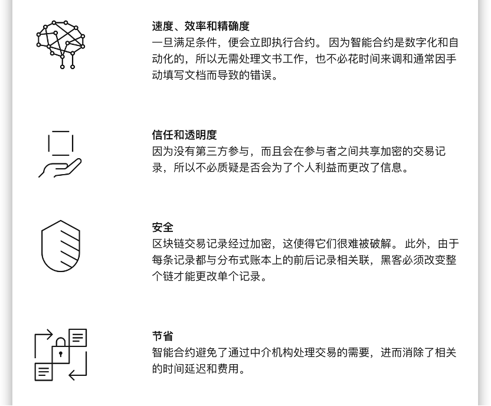

# 智能合约

智能合约是存储在区块链上的程序，在满足预先确定的条件时会运行这些程序。 它们通常用于自动执行协议，以便所有参与者都可以立即确定结果，而无需任何中间人参与，也不会浪费时间。 它们还可以自动完成工作流程，在满足条件时触发下一个操作。

## 智能合约如何工作

智能合约工作时遵循简单的`if/when…then…`语句，这些语句被写入区块链上的代码中。 当满足并验证预先确定的条件时，计算机网络将执行操作。 这些操作可能包括向相应的各方发放资金、登记车辆、发送通知或开具凭单。 然后，在交易完成时会更新区块链。 这意味着交易无法更改，只有获得许可的各方才能看到结果。

在一个智能合约中，可以根据需要设立多项规定来让参与者满意，以便圆满地完成任务。 要确立条款，参与者必须确定交易及其数据在区块链上的表示方式，同意管理这些交易的`if/when...then…`规则，探索所有可能的例外情况，并为解决争议定义一个框架。

## 智能合约的优势

## 智能合约应用

### 原生通证

Neo 系统中定义了两种原生通证，NEO 和 NeoGas（缩写符号 GAS）。

NEO 是治理通证（Governing Token）。持有 NEO 可以参与 Neo 网络的治理，包括投票选举共识节点和修改网络参数等。NEO 的总量为 1 亿，最小单位为 1，且不可分割。在创世块中注册了 NEO 资产，并存放在备用共识节点（StandbyValidators）的多方签名合约地址上。

GAS 是燃料通证（fuel token），用于 Neo 网络的资源控制，最小单位 0.00000001。使用 Neo 网络进行转账、注册资产、发行资产、运行 DApp 等操作需要支付一定的 GAS 手续费。用户可以涌过提取或者购买获取 GAS。

Neo N3 的创世区块将铸造准确数量的 GAS 代币，以对标 NEO legacy 链上流通的所有 GAS 代币。

关于 GAS 的分配规则，可参考[治理与激励](https://docs.neo.org/docs/zh-cn/basic/governance.html)。

### NEP-17 通证

NEP17 协议是 Neo 补充协议中的第 17 号协议，替代了原先的 NEP5 协议。其目的是为 Neo 建立标准的 token 化智能合约通用交互机制。NEP17 资产是在合约存储区内记账，通过对存储区内不同账户 hash 记录余额数值的变化，完成交易。

详情参考：[NEP-17](https://github.com/neo-project/proposals/blob/master/nep-17.mediawiki)

### NEP-11 非同质化代币

NEP11 协议是 Neo 补充协议中的第 11 号协议，定义了 NFT（非同质化资产）的合约编写标准。

详情参考：[NEP-11](https://github.com/neo-project/proposals/blob/master/nep-11.mediawiki)
