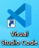
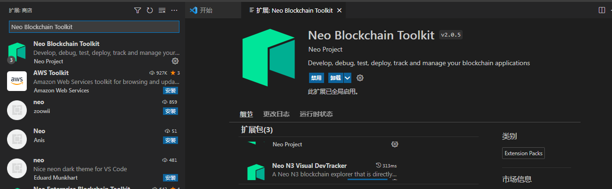
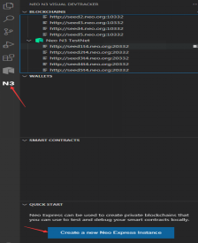
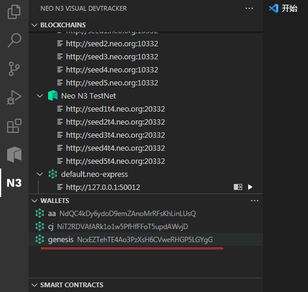
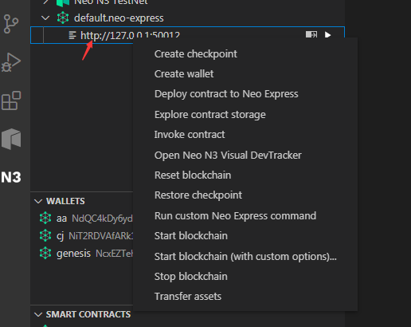

# 安装
1. 安装好Visual Studio Code，双击桌面图标。如图：

2. 搜索Neo Blockchain Toolkit ,安装插件。 如图：

 

3. 安装完毕后，点击N3，然后启动私有节点，以后我们都可以在这个私有节点上，进行本地开发调试。
这个时候已经可以看到启动成功了，发布的服务地址是127.0.0.1:50012

 

系统默认有一个genesis账户，里面有足够的NEO和Gas.你可以创建一个新用户，然后将GAS或者NEO转送给他们

 

在私有节点上(default.neo-express)点击右键，你可以看到很多操作，常用的有:
- Create wallet  创建用户
- Transfer assets.就是发送gas/neo给新用户
- Invoke  contract 是触发合约
- Deploy contract to Neo Express 是部署合约，这个后期我们可以通过程序代码直接部署，不需要在这里进行操作。

 
