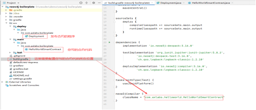
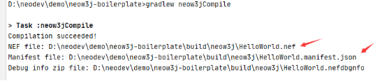
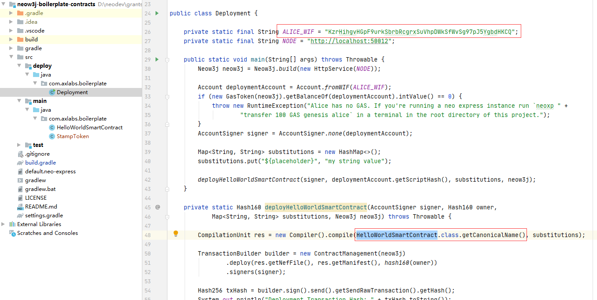
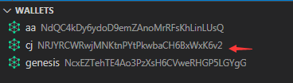
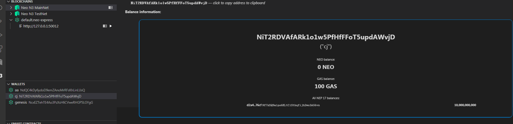
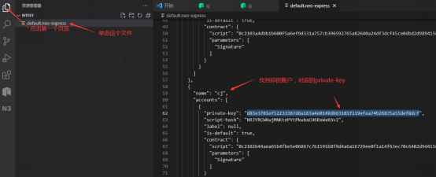
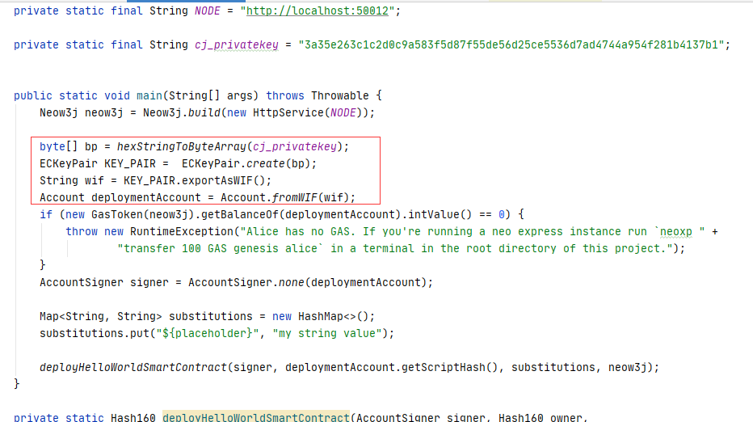
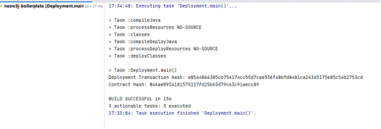
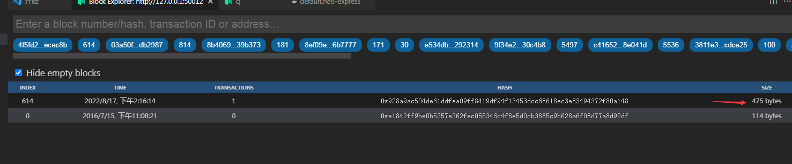

# 下载合约框架
```bash
git clone https://github.com/neow3j/neow3j-boilerplate-contracts.git
```
# 编译和发布合约到NeoExpress

## 单独编译合约代码

在Idea中打开下载好的项目，项目中自带了一个最简单的合约代码`HelloWorldSmartContract.java`，`Deployment.java`是发布部署合约的可用程序，`stampToken.java`是我们自己编写的合约程序。查看目录结构



在`build.gradle`文件中,`className`是对应你的合约代码的位置，如下配置的含义是，将对`HelloWorldSmartContract.java`进行编译
```java
neow3jCompiler {
    className = "com.axlabs.boilerplate.HelloWorldSmartContract"
}
```
>因为我们在StampToken中使用了中文注释，编译的时候会有编码问题，可以在`build.gradle`文件中添加

```java
[compileJava, compileTestJava]*.options*.encoding = 'UTF-8'
```

控制台运行`gradlew neow3jCompile`命令,在对应的目录下，你可以看到编译好的合约文件。得到编译的合约文件，你需要手动去进行部署发布，实际操作中，我们会通过代码直接编译发布更方便。



[关于NEF 和 Manifest 文件请参考这里](https://docs.neo.org/docs/zh-cn/develop/write/manifest.html)

## 编译并发布合约
接下来，我们通过另外一种方式，直接将代码进行编译并且发布到NeoExpress中。我们需要用到两个文件，
- `HelloWorldSmartContract.java` 合约文件
- `Deployment.java`  部署文件



在`Deployment.java`
```java
private static final String ALICE_WIF = "KzrHihgvHGpF9urkSbrbRcgrxSuVhpDWkSfWvSg97pJ5YgbdHKCQ";
private static final String NODE = "http://localhost:50012";
```
- 文件中需要修改`ALICE_WIF`为对应的你的部署合约账户的私钥。
- `NODE`为对应的节点地址，当前是配置的本地私有节点地址，后期可以改为测试网地址，主网地址。

```java
CompilationUnit res = new Compiler().compile(HelloWorldSmartContract.class.getCanonicalName(), substitutions);
```

`HelloWorldSmartContract.class.getCanonicalName()`以后修改为自己编写的新合约JAVA类，我们第一次发布就先用默认的`HelloWorldSmartContract.java`。

### 从NeoExpress中获取Gas
因为发布合约需要支付Gas费用，要在代码中修改发布者的秘钥WIF，NODE是Neo-Express服务地址，默认不需要修改。

启动Neo-Express，在Neo-Express中创建账户，并通过genesis转移一些gas给此账户(发布合约需要10 Gas)

在Neo-Express右键`Create Wallet`输入名字后，就会出现你创建的账户



转移GAS，点击`Transfer assets`.根据提示进行操作,操作成功后，点击账户，即可查看是否接收成功



### 查看账户秘钥



此时出现一个问题，你拿到的不是WIF格式的私钥，我们需要通过方法进行转换一下就行。



```java
    byte[] bp = hexStringToByteArray(cj_privatekey);
    ECKeyPair KEY_PAIR =  ECKeyPair.create(bp);
    String wif = KEY_PAIR.exportAsWIF();
    Account deploymentAccount = Account.fromWIF(wif);
```
修改完毕后，右键执行。Contract Hash就是你合约的地址，合约发布成功



在NEO-EXPRESS中：你可以明显看到某个区块的大小比较大，并且账户中的gas也减少了。

