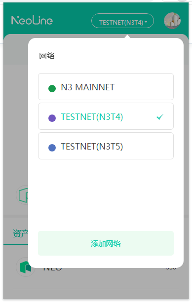
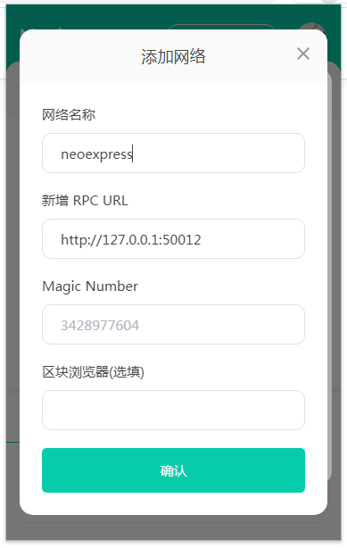
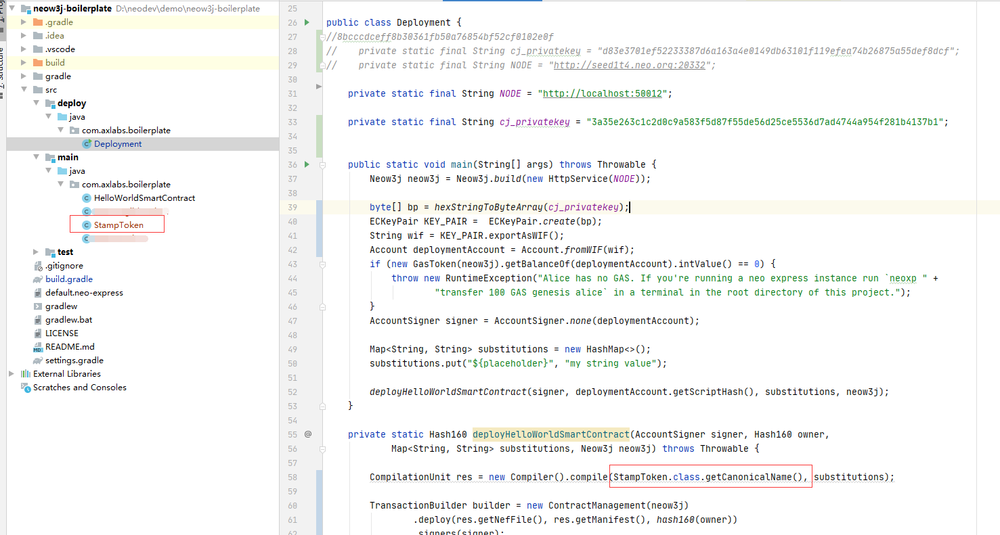
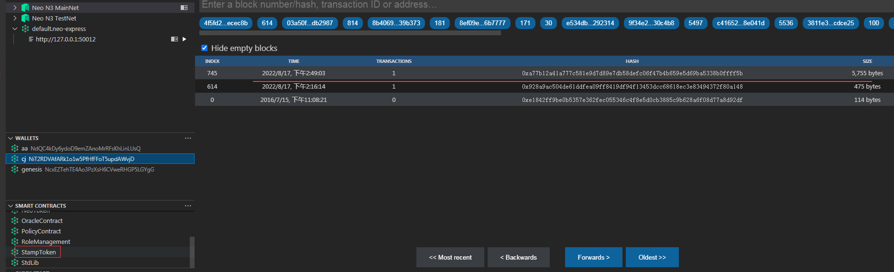
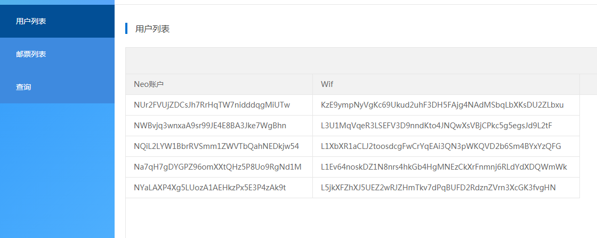
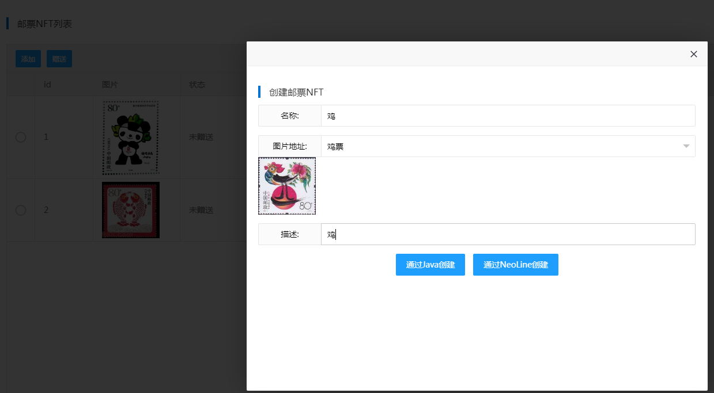
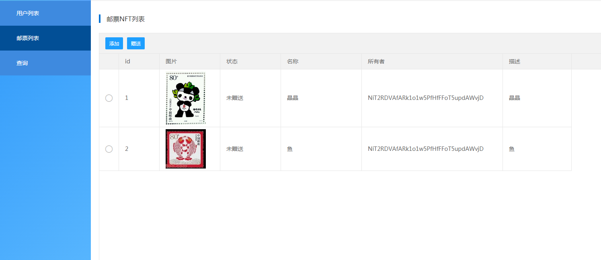
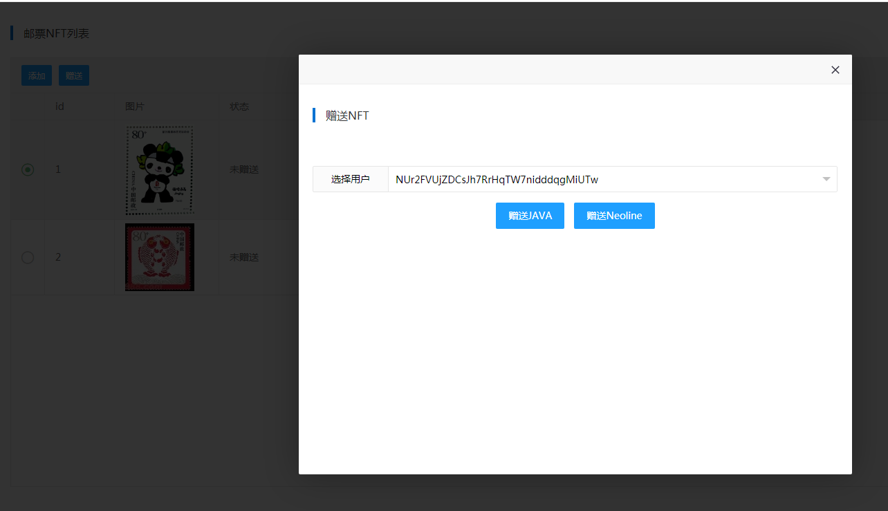
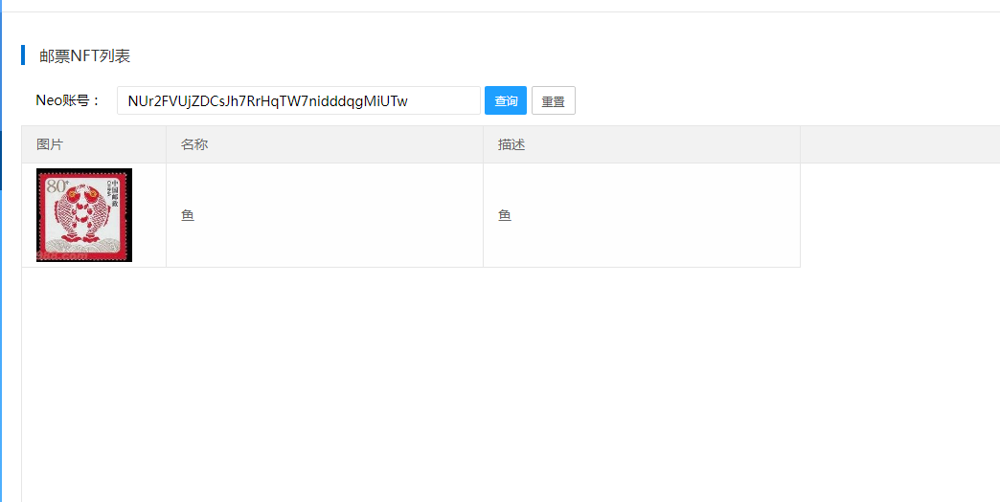

# 应用开发
## 技术架构
- **springboot**
- **thymeleaf,layui,neoline**
- **没有数据库，直接运行项目就可以**
## Neoline
[Neoline](https://neoline.io/)我们使用的是Neoline的谷歌插件，[安装地址](https://tutorial.neoline.io/neo-n3-qian-bao-chuang-jian-jiao-cheng/neoline-chrome-cha-jian-qian-bao)
新版本的Neoline支持我们配置Neo节点地址，我将它配置到我们的NEOEXPRESS上，就可以进行调试了。
设置私有网络，点击添加网络，输入RPC URL地址。



## 开发前准备工作
开启NeoExpress。

将合约发布至`NeoExpress`中，在[合约部署](nft/contract.md)我们已经给cj账户转了100个Gas，我现在将[StampToken](nft/nftcontract)合约发布部署到`NEO-EXPRESS`中



需要用到`Deployment.java`，我们自己写的合约`StampToken.java`

修改`Deployment.java`中的代码将`HelloWorldSmartContract.class.getCanonicalName()`改为`StampToken.class.getCanonicalName()`，右键`run`运行。

```java
CompilationUnit res = new Compiler().compile(StampToken.class.getCanonicalName(), substitutions);
```
控制台输出结果：`Contract Hash`就是生成的合约代码。
```java
> Task :processResources NO-SOURCE
> Task :classes
> Task :compileDeployJava
> Task :processDeployResources NO-SOURCE
> Task :deployClasses

> Task :Deployment.main()
Deployment Transaction Hash: db2b86f01a0148e9069c609b63ae2a1c48db486e2d507a94b54d1de2d69af5df
Contract Hash: f9d9d671380fa8c07d9e62480784ee47acbd67e6

BUILD SUCCESSFUL in 26s
3 actionable tasks: 3 executed
```

在NEOEXPRESS中可以看到一个较大的区块，和新增了一个`StampToken`合约。

## 用户列表


展示了5个演示的账户，可以给这些账户发送铸造好的NFT邮票，以及查询这些账户所持有的NFT邮票

在`com.cj.stamp.util.AccountLists`中提供了生成账户，秘钥的方法

```java
//初始化生成5个账号
    for(int i=0;i<5;i++) {
        //生成地址和秘钥
        try {
            ECKeyPair ecKeyPair = ECKeyPair.createEcKeyPair();
            String address = ecKeyPair.getAddress();
            String wif = ecKeyPair.exportAsWIF();
            System.out.println("new AccountLists(\""+address+"\",\""+wif+"\")");
        } catch (Exception e) {
            e.printStackTrace();
        }
    }
```
## 邮票列表
此功能包含了，与合约的主要交互功能。包含了NFT的`查询`，`铸造`，`赠送`。

在`com.cj.stamp.util.Constants`中设置一些参数，包含了节点地址，合约地址，私钥等
```java
// This sets up the connection to the neo-node of our private network.
public static Neow3j NEOW3J = Neow3j.build(new HttpService("http://localhost:50012", true));
//TestNet
//public static Neow3j NEOW3J = Neow3j.build(new HttpService("http://seed2.neo.org:20332", true));
public static final String Jack_PKEY = "3a35e263c1c2d0c9a583f5d87f55de56d25ce5536d7ad4744a954f281b4137b1";
public static Account cj = Account.fromWIF("KyAs6Hwu6RRi4rZWU3VvosDmPU9Abz7b9DCwmFmrp1JhUYZmc8fh");
public static  Hash160 ContractHash = new Hash160("f9d9d671380fa8c07d9e62480784ee47acbd67e6");
```
### 添加 铸造
添加NFT是通过触发合约中的mint方法来将数据写入区块中。我们提供了JAVA后台和Neoline写入的2种方式，分别对应合约的`mint`方法和`mintNeoLine`。涉及到中文，我们对数据进行了`Base64.Encoder`处理。


#### java端，涉及到写操作，所以需要签名验证
```java
    @RequestMapping("/mint")
    @ResponseBody
    public MyResponse mint(HttpServletRequest request,TokenInfo t) {

        SmartContract contract = new SmartContract(Constants.ContractHash, Constants.NEOW3J);
        // Create the transaction builder.
        TransactionBuilder transactionBuilder = new TransactionBuilder(Constants.NEOW3J);
        // Create mint scripts and add them to the transaction builder.
        HashMap<String, String> propertiesMap = new HashMap<>();
        try {
            propertiesMap.put("name",  encoder.encodeToString(t.getName().getBytes("UTF-8")));
            propertiesMap.put("description",  encoder.encodeToString(t.getDescription().getBytes("UTF-8")));
            propertiesMap.put("image",   encoder.encodeToString(t.getImage().getBytes("UTF-8")));

            byte[] invokeScript = contract.buildInvokeFunctionScript("mint",
                    ContractParameter.hash160(Constants.cj.getScriptHash()),
                    ContractParameter.map(propertiesMap));
            // Add the script to the transaction builder.
            transactionBuilder.extendScript(invokeScript);
            // Set the account cj as the signer, since it is the owner of the contract and sign the transaction.
            Transaction tx = transactionBuilder.signers(AccountSigner.calledByEntry(Constants.cj))
                    .sign();

            NeoSendRawTransaction response = tx.send();
            Hash256 txHash = null;
            if (response.hasError()) {
                System.out.printf("The neo-node responded with the error message '%s'.%n",
                        response.getError().getMessage());
            } else {
                txHash = response.getSendRawTransaction().getHash();
                System.out.printf("Successfully transmitted the transaction with hash '%s'.%n", txHash);
                System.out.println("Waiting until transaction is persisted in a block...");
                Await.waitUntilTransactionIsExecuted(txHash,  Constants.NEOW3J);
                System.out.println( Constants.NEOW3J.getTransaction(txHash).send().getTransaction());
                // To check the transaction's status, you can check its application log.
                // -> see the example `GetApplicationLogsForTx.java`
                System.out.println("\n####################");
            }
        }catch (Exception e){
            e.printStackTrace();
        }catch(Throwable throwable) {
            throwable.printStackTrace();
        }
        return MyResponse.buildSuccess();
    }
```
#### neoline端
`\src\main\resources\static\js\neolinefun.js` `scriptHash`是合约地址，`operation`是触发的合约方法名，`args`是参数对应合约方法`mintNeoLine`中对应的参数
```javascript
function mint() {
    neolineN3.invoke({
        scriptHash: 'f9d9d671380fa8c07d9e62480784ee47acbd67e6',
        operation: 'mintNeoLine',
        args: [
            {
                type: "Address",
                value: addressscriptHash
            },
            {
                type: 'Array', value: [
                    { type: 'String', value: Base64.encode(datas.name) },
                    { type: 'String', value: Base64.encode(datas.image) },
                    { type: 'String', value: Base64.encode(datas.description) }
                ]
            }

        ],
        broadcastOverride: false,
        signers: [
            {
                account: addressscriptHash,
                scopes: 1
            }
        ]
    })
```
注意第二个参数类型是`Array`，对应的合约代码使用了`@Struct`将`Object`进行了强转就可以用`对象.属性`的方法进行访问。
```java
 @Struct
    static class MyStruct {
        String name;
        String image;
        String description;
    }


    public static void mintNeoLine(Hash160 owner,Object data) {
        MyStruct myData = (MyStruct) data;
        ......
        propNameMap.put(tokenId, myData.name);
        propDescriptionMap.put(tokenId, myData.description);
        propImageMap.put(tokenId, myData.image);
```     
或者可以不使用`Array`，改为传递3个String，对应的合约接收参数方法：
```java
public static void mintNeoLineStr(Hash160 owner,String name,String image, String description) 
 ``` 

### 展示列表


通过触发合约的`tokens`方法，获取数据，通过解析获取`tokenid`列表，然后再调用合约`properties`和`ownerOf`来获取详细信息，封装成对象列表返回到前端展示。
```java
    @RequestMapping("/stampList/list")
    @ResponseBody
    public MyResponse list(HttpServletRequest request) {
        List<TokenInfo> tlist = new ArrayList<TokenInfo>();
        try {
            NonFungibleToken nft = new NonFungibleToken(Constants.ContractHash,Constants.NEOW3J);
            List<StackItem> gg =nft.callFunctionReturningIterator("tokens",new ContractParameter[0]);
            for(StackItem l:gg){
                StructStackItem sStack = (StructStackItem)l;
                List<StackItem> value = sStack.getValue();
                int flag = 1;
                for(StackItem b:value){
                    ByteStringStackItem bs = (ByteStringStackItem)b;
                    if(flag==2){
                        flag=1;
                    }else{
                        //tokenid
                        String tid =  bs.getInteger().toString();
                        TokenInfo t = service.getProperties(nft,bs.getValue());
                        Hash160 hash160 = nft.ownerOf(bs.getValue());
                        t.setOwner(hash160.toAddress());
                        t.setTokenid(tid);
                        tlist.add(t);
                    }
                    flag++;
                }

            }
        } catch (Exception e) {
            e.printStackTrace();
        }
        return MyResponse.buildSuccess(tlist);
    }
```

`NonFungibleToken`是neow3j封装好的操作NonFungibleToken合约的类，构造函数传递合约地址，节点地址。调用相应的方法就可以与区块链数据进行交互。
```java
NonFungibleToken nft = new NonFungibleToken(Constants.ContractHash,Constants.NEOW3J);
List<StackItem> gg =nft.callFunctionReturningIterator("tokens",new ContractParameter[0]);
```
`getProperties`方法触发合约的`properties`方法读取详情数据，调用`nft.properties(l)`。
```java
    private TokenInfo getProperties(NonFungibleToken nft,byte[] l){
        TokenInfo tokenInfo = new TokenInfo();
        try {
            Map<String, String> props = nft.properties(l);
            tokenInfo.setName(props.get("name")==null?"":new String(decoder.decode(props.get("name")), "UTF-8"));
            tokenInfo.setDescription(props.get("description")==null?"":new String(decoder.decode(props.get("description")), "UTF-8"));
            tokenInfo.setImage(props.get("image")==null?"":new String(decoder.decode(props.get("image")), "UTF-8"));
        } catch (IOException e) {
            e.printStackTrace();
        }
        return tokenInfo;
    }
```
### 赠送
选择一个NFT进行赠送

#### java端
调用`nft.transfer`对应三个参数`transfer(Account from, Hash160 to, byte[] tokenId)`分别是发送者，接收者，`NFT`的`tokenId`
```java
@RequestMapping("/transfer")
@ResponseBody
public MyResponse transfer(String tokenid,String address) {
    byte[] tokenidarr = BigIntegers.toLittleEndianByteArray(new Integer(tokenid));
    try {
        Account account = Account.fromAddress(address);
        NonFungibleToken nft = new NonFungibleToken(Constants.ContractHash,Constants.NEOW3J);
        NeoSendRawTransaction response = nft.transfer(Constants.cj,account.getScriptHash(), tokenidarr).sign().send();
        trackSentTransaction(response);
    }catch (Exception e){
        e.printStackTrace();
        return MyResponse.buildFailed(e.getMessage());
    } catch (Throwable throwable) {
        throwable.printStackTrace();
    }

    return MyResponse.buildSuccess();
}
```
`trackSentTransaction`方法一直等待到数据上链，大概15秒。不想等待也可以直接返回txHash。
```java
public static void trackSentTransaction(NeoSendRawTransaction response) throws IOException {

    System.out.println("####################\n");
    if (response.hasError()) {
        System.out.printf("The neo-node responded with the error message '%s'.%n",
                response.getError().getMessage());
    } else {
        Hash256 txHash = response.getSendRawTransaction().getHash();
        System.out.printf("Successfully transmitted the transaction with hash '%s'.%n", txHash);
        System.out.println("Waiting until transaction is persisted in a block...");
        Await.waitUntilTransactionIsExecuted(txHash, Constants.NEOW3J);
        System.out.println(Constants.NEOW3J.getTransaction(txHash).send().getTransaction());
        // To check the transaction's status, you can check its application log.
        // -> see the example `GetApplicationLogsForTx.java`
        System.out.println("\n####################");
    }
}
```
#### neoline端
`\src\main\resources\static\js\neolinefun.js` 传递对应的参数。`Neon`是`neon-js`提供的js开发包。NeoLine就是使用了[neon-js](https://github.com/CityOfZion/neon-js/)，开发的一套插件
```javascript
function transfer(tokenid,address) {
    neolineN3.invoke({
        scriptHash: 'f9d9d671380fa8c07d9e62480784ee47acbd67e6',
        operation: 'transfer',
        args: [
            {
                type: 'Hash160',
                value: Neon.sc.ContractParam.hash160(address).toJson().value,
            },
            {
                type: 'Integer',
                value: Neon.sc.ContractParam.integer(tokenid).toJson().value,
            },
            {
                type: 'Any',
                value: null,
            },
        ],
        broadcastOverride: false,
        signers: [
            {
                account: addressscriptHash,
                scopes: 1
            }
        ]
    })
```
## 查询
输入NEO地址，查询所拥有的NFT

调用`nft.tokensOf`触发合约tokensOf方法返回`tokenId`再通过tokenId去调用`getProperties`查询详情
```java
@RequestMapping("/tokensOf")
@ResponseBody
public MyResponse tokensOf(String address) {

    List<TokenInfo> tlist = new ArrayList<TokenInfo>();
    if(StringUtils.isEmpty(address)){
        return   MyResponse.buildSuccess(tlist);
    }
    try {
        Account account = Account.fromAddress(address);

        NonFungibleToken nft = new NonFungibleToken(Constants.ContractHash,Constants.NEOW3J);
        List<byte[]> list = nft.tokensOf(account.getScriptHash());
        for(byte[] l:list){
            BigInteger bigInteger =  Numeric.toBigInt(l);
            TokenInfo tokenInfo = getProperties(nft,l);
            tokenInfo.setTokenid(bigInteger.intValue()+"");
            tlist.add(tokenInfo);
        }

    }catch (Exception e){
        e.printStackTrace();
    }
    return MyResponse.buildSuccess(tlist);
}
```