# 前言

接下来将演示如何在windows上搭建多节点的客户端，让你对Neo区块链的运行有个直观的感受。

# 下载NeoCli客户端
在 GitHub 上下载系统对应的 [Neo-CLI](https://github.com/neo-project/neo-node/releases) 当前版本为`Neo CLI v3.5.0`点击`neo-cli-win-x64.zip`进行下载

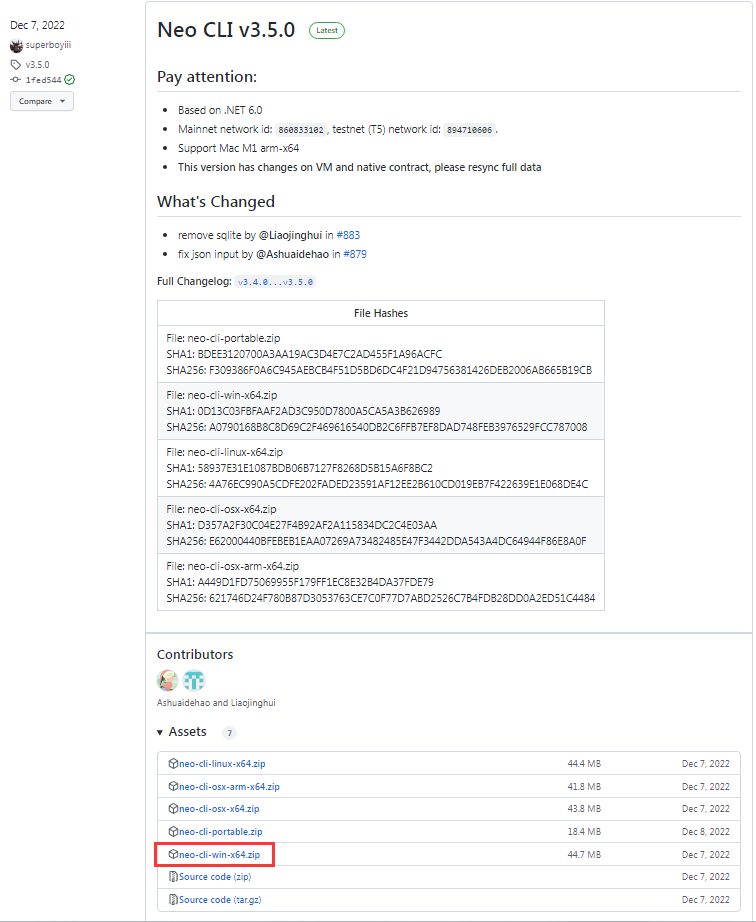

#  配置简介
下载好的压缩包只要进行解压，双击`neo-cli.exe`即可启动节点，不过此时启动的节点是连接主网节点的。
搭建私有节点，主要是对配置文件进行配置。默认的安装包只是最普通的节点，不是共识节点，只有共识节点才能出块。我们还需要添加一些插件进行配置。
通过上面的配置操作，就可以完成多节点的搭建。
我们需要4个共识节点来完成多节点的搭建。

>为什么需要4个节点？
>因为4是多节点模式中的最少节点数，在dBFT 2.0共识算法中只要参与共识的错误节点不超过 ⌊ (N−1) / 3 ⌋，就能保证整个系统正常运作.
N最小为4，错误节点就是1.也就是我们搭建好的4个共识节点的多节点环境，当一个节点异常，不是影响整个区块链的出块，当异常节点大于1.整个区块将会停止出块。
[更多查看](https://docs.neo.org/docs/zh-cn/basic/consensus/dbft.html) 

# 安装插件

一些附加功能被独立封装在插件中用以调用，提升了节点的安全性，稳定性和灵活性。关于插件的详细信息，请参见 安装插件 。

所需要在 [这里](https://github.com/neo-project/neo-modules/releases/) 下载安装以下插件，以保证 API 的正常使用和自动读取离线包的完整性：

| 插件              | 功能                                                         | 说明         |
| ----------------- | ----------------------------------------------------------   | ------------|
| ApplicationLogs   | 同步智能合约和 NativeContract 的日志（Notify）                 |              |
| LevelDBStore      | 区块链数据使用 LevelDB 存储引擎                                |（NeoCli已预装）|
| RpcServer         | 提供节点的 RPC 功能。NeoLine或者Java去和节点交互都是通过RPC来进行| 必选 | 
| TokensTracker     | 提供NEP-11、NEP-17余额及交易历史的RPC查询功能                   | 推荐 | 
| DBFTPlugin        | dBFT 共识插件                                                 | 作为共识节点时必选 | 

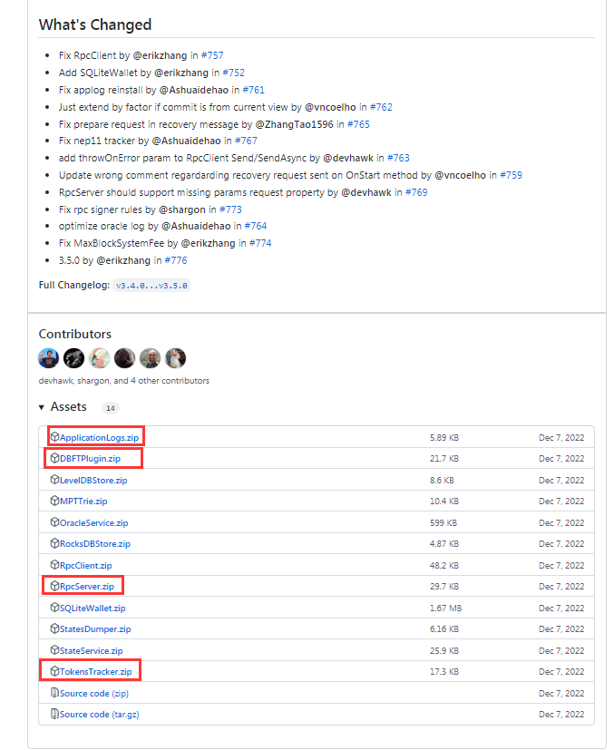

将下载好的zip包，进行解压，解压后拷贝到和neocli中`neo-cli.exe`同级目录中，因为默认已经预装了leveldb在plugin中，所以会问你是否合并直接点是

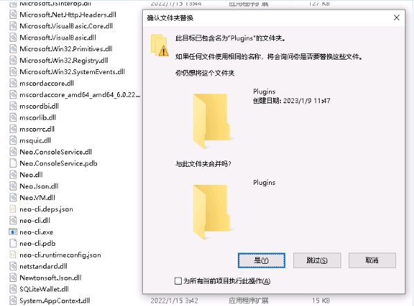

最终插件目录如下

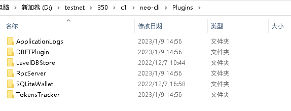

# 复制节点 
将已经安装了插件的客户端，文件复制3份（共4个客户端），文件夹名分别命名为 c1、c2、c3、c4。

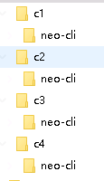

# 创建钱包文件 
使用 Neo-CLI 创建四个不同的钱包文件，命名为 1.json、2.json、3.json、4.json，分别放置于四个节点的neo-cli文件夹中。
进入第一个节点`c1/neo-cli`节点中，双击`neo-cli.exe`启动创建钱包文件输入`help`可以查看所有命令.
 - 输入 create wallet <path> 命令创建一个钱包，如 create wallet 1.json 。
 - 设置钱包密码（password），并确认密码。
 - 记录钱包公钥（pubkey），后面会用到。

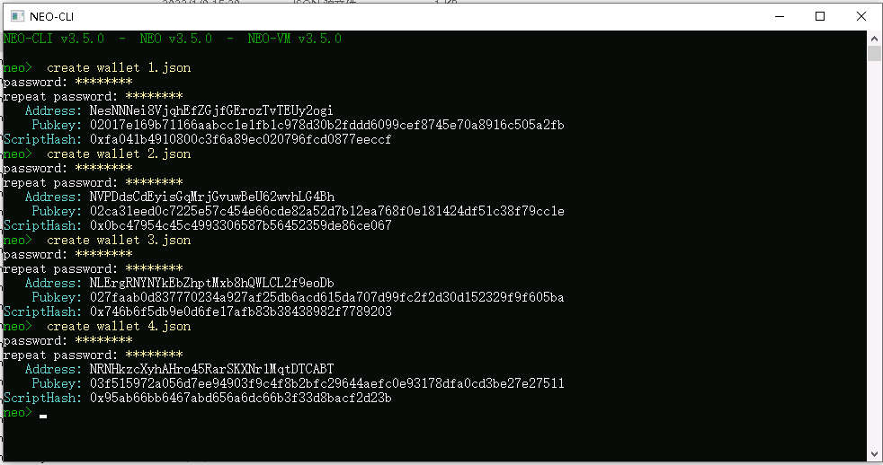

创建完毕后，会在根目录下找到1.json ,2.json,3.json,4.json的钱包文件，分别拷贝到对应的节点中。
因为我们启动了c1的节点去创建钱包文件，但是没有做任何配置，所以它是去同步主网的数据的，当我们进行私链搭建的时候就出现数据冲突，这时候我们需要把C1节点的数据清空
把下面3个文件夹清空即可


# 修改 config.json
在每个节点下的 config.json 文件中进行如下修改：

设置每个端口不重复且不被其它程序占用。

设置 UnlockWallet 下的参数 Path 为钱包文件名， Password 为钱包密码。

设置 StartConsensus 和 IsActive 为 true 。

Network 为私有链 ID，可设置为 [0 - 4294967295] 区间内的任意整数。所有节点的Network必须一致。

StandbyCommittee 是委员会成员节点的公钥，票数前 4 的即为共识节点，这里可以输入 4 个钱包的公钥。

SeedList 为种子节点的 IP 地址和端口号，IP 地址设置为 localhost，端口为 4 个节点的 P2P Port。

> 注意： MaxConnectionsPerAddress默认是3.代表一台电脑最多能运行3个节点。我们是4个节点，在一台电脑上启动，永远第四个节点启动失败。切记修改此属性

## c1/config.json

```
{
  "ApplicationConfiguration": {
    "Logger": {
      "Path": "Logs",
      "ConsoleOutput": true,
      "Active": true
    },
    "Storage": {
      "Engine": "LevelDBStore",
      "Path": "Data_LevelDB_{0}"
    },
    "P2P": {
      "Port": 10333,
      "WsPort": 10334,
      "MinDesiredConnections": 10,
      "MaxConnections": 40,
      "MaxConnectionsPerAddress": 8
    },
    "UnlockWallet": {
      "Path": "n1.json",
      "Password": "11111111",
      "IsActive": true
    }
  },
  "ProtocolConfiguration": {
    "Network": 1234567,
    "AddressVersion": 53,
    "MillisecondsPerBlock": 15000,
    "MaxTransactionsPerBlock": 512,
    "MemoryPoolMaxTransactions": 50000,
    "MaxTraceableBlocks": 2102400,
    "Hardforks": {
      "HF_Aspidochelone": 1730000
    },
    "InitialGasDistribution": 5200000000000000,
    "ValidatorsCount": 4,
    "StandbyCommittee": [
      "02017e169b71166aabcc1e1fb1c978d30b2fddd6099cef8745e70a8916c505a2fb",
	  "02ca31eed0c7225e57c454e66cde82a52d7b12ea768f0e181424df51c38f79cc1e",
	  "027faab0d837770234a927af25db6acd615da707d99fc2f2d30d152329f9f605ba",
	  "03f515972a056d7ee94903f9c4f8b2bfc29644aefc0e93178dfa0cd3be27e27511"
    ],
   "SeedList": [
      "192.168.0.88:10333",
      "192.168.0.88:20333",
      "192.168.0.88:30333",
      "192.168.0.88:40333"
    ]
  }
}
```

## c2/config.json

```
{
  "ApplicationConfiguration": {
    "Logger": {
      "Path": "Logs",
      "ConsoleOutput": true,
      "Active": true
    },
    "Storage": {
      "Engine": "LevelDBStore",
      "Path": "Data_LevelDB_{0}"
    },
    "P2P": {
      "Port": 20333,
      "WsPort": 20334,
      "MinDesiredConnections": 10,
      "MaxConnections": 40,
      "MaxConnectionsPerAddress": 8
    },
    "UnlockWallet": {
      "Path": "2.json",
      "Password": "11111111",
      "IsActive": true
    }
  },
  "ProtocolConfiguration": {
    "Network": 1234567,
    "AddressVersion": 53,
    "MillisecondsPerBlock": 15000,
    "MaxTransactionsPerBlock": 512,
    "MemoryPoolMaxTransactions": 50000,
    "MaxTraceableBlocks": 2102400,
    "Hardforks": {
      "HF_Aspidochelone": 1730000
    },
    "InitialGasDistribution": 5200000000000000,
    "ValidatorsCount": 4,
    "StandbyCommittee": [
      "02017e169b71166aabcc1e1fb1c978d30b2fddd6099cef8745e70a8916c505a2fb",
	  "02ca31eed0c7225e57c454e66cde82a52d7b12ea768f0e181424df51c38f79cc1e",
	  "027faab0d837770234a927af25db6acd615da707d99fc2f2d30d152329f9f605ba",
	  "03f515972a056d7ee94903f9c4f8b2bfc29644aefc0e93178dfa0cd3be27e27511"
    ],
   "SeedList": [
      "192.168.0.88:10333",
      "192.168.0.88:20333",
      "192.168.0.88:30333",
      "192.168.0.88:40333"
    ]
  }
}
```
## c3/config.json
```
{
  "ApplicationConfiguration": {
    "Logger": {
      "Path": "Logs",
      "ConsoleOutput": true,
      "Active": true
    },
    "Storage": {
      "Engine": "LevelDBStore",
      "Path": "Data_LevelDB_{0}"
    },
    "P2P": {
      "Port": 30333,
      "WsPort": 30334,
      "MinDesiredConnections": 10,
      "MaxConnections": 40,
      "MaxConnectionsPerAddress": 8
    },
    "UnlockWallet": {
      "Path": "3.json",
      "Password": "11111111",
      "IsActive": true
    }
  },
  "ProtocolConfiguration": {
    "Network": 1234567,
    "AddressVersion": 53,
    "MillisecondsPerBlock": 15000,
    "MaxTransactionsPerBlock": 512,
    "MemoryPoolMaxTransactions": 50000,
    "MaxTraceableBlocks": 2102400,
    "Hardforks": {
      "HF_Aspidochelone": 1730000
    },
    "InitialGasDistribution": 5200000000000000,
    "ValidatorsCount": 4,
    "StandbyCommittee": [
      "02017e169b71166aabcc1e1fb1c978d30b2fddd6099cef8745e70a8916c505a2fb",
	  "02ca31eed0c7225e57c454e66cde82a52d7b12ea768f0e181424df51c38f79cc1e",
	  "027faab0d837770234a927af25db6acd615da707d99fc2f2d30d152329f9f605ba",
	  "03f515972a056d7ee94903f9c4f8b2bfc29644aefc0e93178dfa0cd3be27e27511"
    ],
   "SeedList": [
      "192.168.0.88:10333",
      "192.168.0.88:20333",
      "192.168.0.88:30333",
      "192.168.0.88:40333"
    ]
  }
}

```
## c4/config.json
```
{
  "ApplicationConfiguration": {
    "Logger": {
      "Path": "Logs",
      "ConsoleOutput": true,
      "Active": true
    },
    "Storage": {
      "Engine": "LevelDBStore",
      "Path": "Data_LevelDB_{0}"
    },
    "P2P": {
      "Port": 40333,
      "WsPort": 40334,
      "MinDesiredConnections": 10,
      "MaxConnections": 40,
      "MaxConnectionsPerAddress": 8
    },
    "UnlockWallet": {
      "Path": "4.json",
      "Password": "11111111",
      "IsActive": true
    }
  },
  "ProtocolConfiguration": {
    "Network": 1234567,
    "AddressVersion": 53,
    "MillisecondsPerBlock": 15000,
    "MaxTransactionsPerBlock": 512,
    "MemoryPoolMaxTransactions": 50000,
    "MaxTraceableBlocks": 2102400,
    "Hardforks": {
      "HF_Aspidochelone": 1730000
    },
    "InitialGasDistribution": 5200000000000000,
    "ValidatorsCount": 4,
    "StandbyCommittee": [
      "02017e169b71166aabcc1e1fb1c978d30b2fddd6099cef8745e70a8916c505a2fb",
	  "02ca31eed0c7225e57c454e66cde82a52d7b12ea768f0e181424df51c38f79cc1e",
	  "027faab0d837770234a927af25db6acd615da707d99fc2f2d30d152329f9f605ba",
	  "03f515972a056d7ee94903f9c4f8b2bfc29644aefc0e93178dfa0cd3be27e27511"
    ],
   "SeedList": [
      "192.168.0.88:10333",
      "192.168.0.88:20333",
      "192.168.0.88:30333",
      "192.168.0.88:40333"
    ]
  }
}
```
# RpcServer 插件

# 配置共识插件 

修改其配置文件 neo-cli\Plugins\DBFTPlugin\config.json ：

将 Network 与私有链 config.json 中的 Network 设为相同数值。

AutoStart ：设为 true 以方便在启动 CLI 时自动开启共识。

可参照下面的配置：

Plugins/DBFTPlugin/config.json
```
{
  "PluginConfiguration": {
    "RecoveryLogs": "ConsensusState",
    "IgnoreRecoveryLogs": false,
    "AutoStart": true,
    "Network": 1234567,
    "MaxBlockSize": 2097152,
    "MaxBlockSystemFee": 150000000000
  }
}

```

# 启动私有链

双击c1,c2,c3,c4节点中的`neo-cli.exe`即可启动节点。

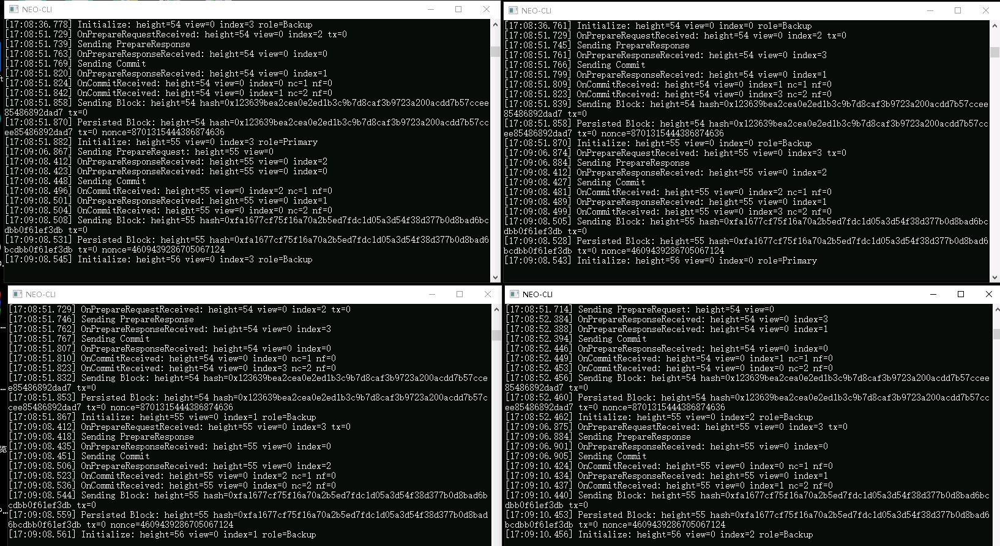

如果控制台打印出共识信息并且区块高度增长表示私链成功搭建。

尝试命令 `show state` 可以看到当前的同步信息

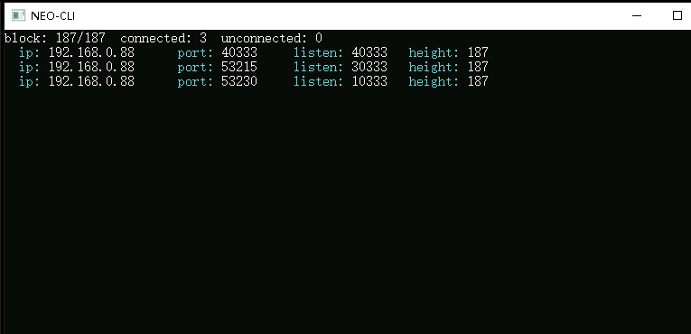

> 输入help查看更多命令。你可以尝试关闭1个节点，看会发生什么变化。关闭2个节点会出现什么情况


# 提取 NEO 和 GAS
在 NEO 网络的创世块中存放着NEO和GAS，当私链搭建起来后，GAS 也将伴着新区块的生成而生成。你可以使用 Neo-CLI 从多方签名合约中提取出这部分 NEO 和 GAS 以便内部开发测试使用。

# 从 Neo-CLI 提取 

创建[多方签名地址](../BlockchainBasics/02-basic-knowledge?id=多方签名地址)


重新解压一份Neo-CLI，同时复制 4 个共识节点钱包到该节点，修改config.json。

和共识节点的区别主要是修改了P2P的端口和UnlockWallet改为false

```
{
  "ApplicationConfiguration": {
    "Logger": {
      "Path": "Logs",
      "ConsoleOutput": true,
      "Active": true
    },
    "Storage": {
      "Engine": "LevelDBStore",
      "Path": "Data_LevelDB_{0}"
    },
    "P2P": {
      "Port": 50333,
      "WsPort": 50334,
      "MinDesiredConnections": 10,
      "MaxConnections": 40,
      "MaxConnectionsPerAddress": 8
    },
    "UnlockWallet": {
      "Path": "",
      "Password": "",
      "IsActive": false
    }
  },
  "ProtocolConfiguration": {
    "Network": 1234567,
    "AddressVersion": 53,
    "MillisecondsPerBlock": 15000,
    "MaxTransactionsPerBlock": 512,
    "MemoryPoolMaxTransactions": 50000,
    "MaxTraceableBlocks": 2102400,
    "Hardforks": {
      "HF_Aspidochelone": 1730000
    },
    "InitialGasDistribution": 5200000000000000,
    "ValidatorsCount": 4,
    "StandbyCommittee": [
      "02017e169b71166aabcc1e1fb1c978d30b2fddd6099cef8745e70a8916c505a2fb",
	  "02ca31eed0c7225e57c454e66cde82a52d7b12ea768f0e181424df51c38f79cc1e",
	  "027faab0d837770234a927af25db6acd615da707d99fc2f2d30d152329f9f605ba",
	  "03f515972a056d7ee94903f9c4f8b2bfc29644aefc0e93178dfa0cd3be27e27511"
    ],
   "SeedList": [
	  "192.168.0.88:10333",
      "192.168.0.88:20333",
      "192.168.0.88:30333",
      "192.168.0.88:40333"
    ]
  }
}
```
启动新接解压的节点,输入命令`show state`会看到连接到了共识节点，并且在同步区块。代表配置正确。

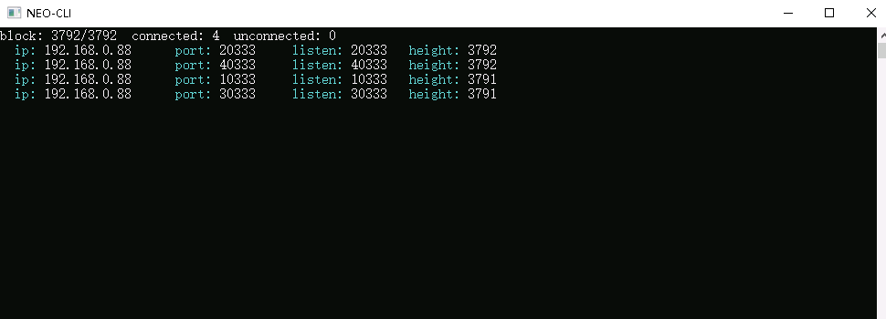

创建 admin 钱包，我们将资产导入到我们创建的这个钱包中

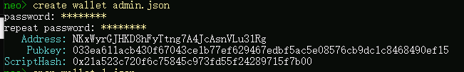

分别打开钱包 1.json , 2.json , 3.json 导入多签地址。


通过`open wallet 1.json`打开钱包，然后使用命令 import multisigaddress m pubkeys ，创建一个多方签名地址。

这里设置最小签名数 m 为 3，pubkeys 为四个共识节点的公钥（见 config.json）。

```bash
import multisigaddress 3 02017e169b71166aabcc1e1fb1c978d30b2fddd6099cef8745e70a8916c505a2fb 02ca31eed0c7225e57c454e66cde82a52d7b12ea768f0e181424df51c38f79cc1e 027faab0d837770234a927af25db6acd615da707d99fc2f2d30d152329f9f605ba 03f515972a056d7ee94903f9c4f8b2bfc29644aefc0e93178dfa0cd3be27e27511
```

`show list`查看资产。你会看到第一个地址有486个gas.这是作为共识节点的出块奖励。

```bash
NWYYKni5n3QqkQsqY8WTpY84bv2Hr7NMkk
NEO: 100000000
GAS: 52000000
这是多签地址的资产
```
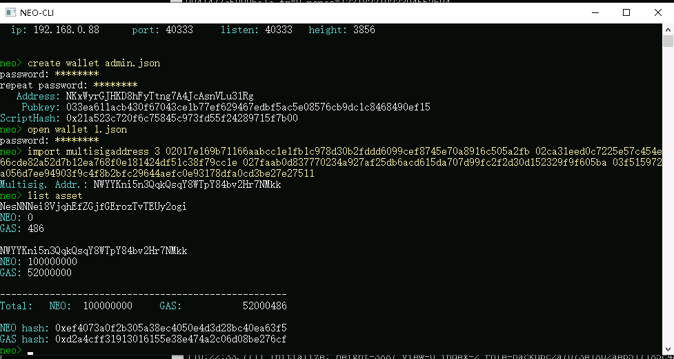

重复上述步骤操作2.json和3.json钱包

> 至少 3 个共识钱包创建多方签名地址才能成功完成转账交易的签名。所以我们用3个钱包就可以了。

# 提取 GAS 到普通地址 

接下来我们将 GAS 从多签地址转入普通地址：

1. 打开第一个钱包（1.json）使用命令 send <id|alias> <address> <value> 将 GAS 转入 admin 钱包地址。

```bash
send gas NKxWyrGJHKD8hFyTtng7A4JcAsnVLu31Rg 10000000
```

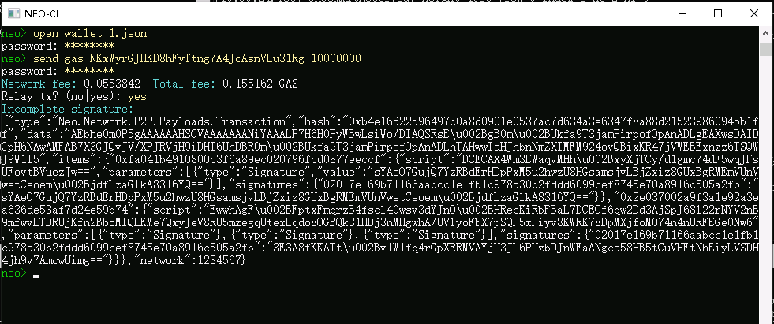

2. 复制 Incomplete Signature 内容

3. 打开第二个钱包（2.json）。

4. 使用步骤 2 中复制的内容输入命令 sign <jsonObjectToSign>

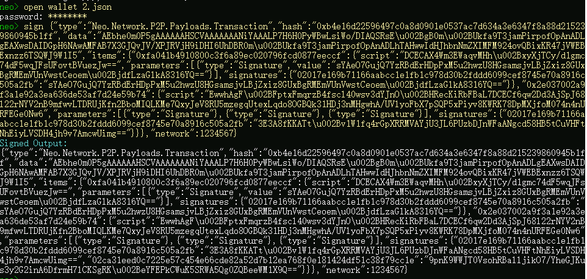

5. 复制 Signed Output 内容

6. 打开第三个钱包（3.json）先sign <jsonObjectToSign>（上一步的Signed Output），然后就可以使用 relay <jsonObjectToSign> 广播交易完成签名。

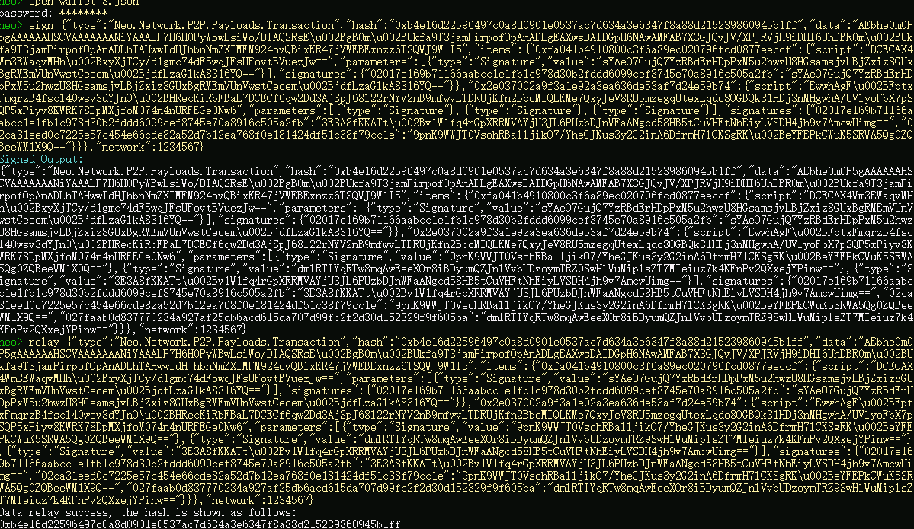

7. open admin钱包输入 list asset 查看钱包资产，可以看到 GAS 已经转入。

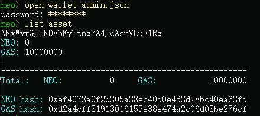


